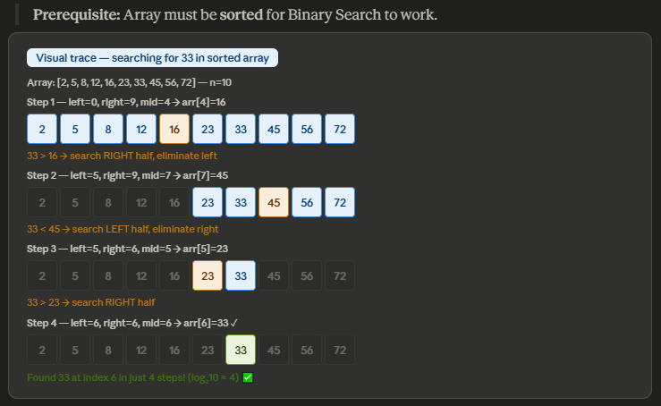

 
## What is Binary Search?
 
Instead of checking every element one by one, Binary Search repeatedly cuts the search space in half by comparing with the middle element.
 
> **Prerequisite:** Array must be **sorted** for Binary Search to work.
 
```java
int binarySearch(int[] arr, int target) {
    int left = 0, right = arr.length - 1;
    while (left <= right) {
        int mid = left + (right - left) / 2;
        if (arr[mid] == target) return mid;        // found
        else if (arr[mid] < target) left = mid + 1; // go right
        else right = mid - 1;                       // go left
    }
    return -1;  // not found
}
```
 
---
 
## The Halving Pattern — Why O(log n)?
 
After each step, the search space is cut in half:
 
| Step | Search space | Formula |
|---|---|---|
| Start | `n` elements | `n` |
| After step 1 | `n/2` elements | `n / 2¹` |
| After step 2 |` n/4` elements | `n / 2²` |
| After step 3 | `n/8` elements |` n / 2³` |
| After step k | `1` element | `n / 2ᵏ = 1 `|
 
**Mathematical proof:**
 
```
n / 2ᵏ = 1
n = 2ᵏ
k = log₂(n)
→ O(log n)
```
 
> We stop when search space = 1. That takes exactly log₂(n) steps.
 
---
 
## Visual Trace — Searching for 33


 
Array: `[2, 5, 8, 12, 16, 23, 33, 45, 56, 72]` — n = 10
 
```
Step 1: left=0, right=9, mid=4 → arr[4]=16
        33 > 16 → search RIGHT half
 
Step 2: left=5, right=9, mid=7 → arr[7]=45
        33 < 45 → search LEFT half
 
Step 3: left=5, right=6, mid=5 → arr[5]=23
        33 > 23 → search RIGHT half
 
Step 4: left=6, right=6, mid=6 → arr[6]=33 ✅ FOUND!
```
 
Found in **4 steps** for n=10. log₂(10) ≈ 4 ✅
 
---
 
## Power of Halving
 
| n (array size) | Linear Search steps | Binary Search steps |
|---|---|---|
| 10 | 10 | 4 |
| 100 | 100 | 7 |
| 1,000 | 1,000 | 10 |
| 1,000,000 | 1,000,000 | 20 |
| 1,000,000,000 | 1,000,000,000 | 30 |
 
> For 1 billion elements, Binary Search takes only **30 steps**. Linear Search takes 1 billion.
 
---
 
## Best / Average / Worst Case
 
| Case | When | Time | Space (iterative) |
|---|---|---|---|
| Best | Target is the middle element | O(1) | O(1) |
| Average | Target found after few halvings | O(log n) | O(1) |
| Worst | Target not found / at edge | O(log n) | O(1) |
 
---
 
## Linear Search vs Binary Search
 
| | Linear Search | Binary Search |
|---|---|---|
| Time | O(n) | O(log n) |
| Space | O(1) | O(1) iterative / O(log n) recursive |
| Requires sorted? | ❌ No | ✅ Yes |
| Works on linked list? | ✅ Yes | ❌ No |
 

 
## Key Takeaway
 
```
Any algorithm that HALVES the problem each step → O(log n)
 
Doubling n only adds 1 more step:
  n=1000  → 10 steps
  n=2000  → 11 steps
  n=4000  → 12 steps
```
 
 