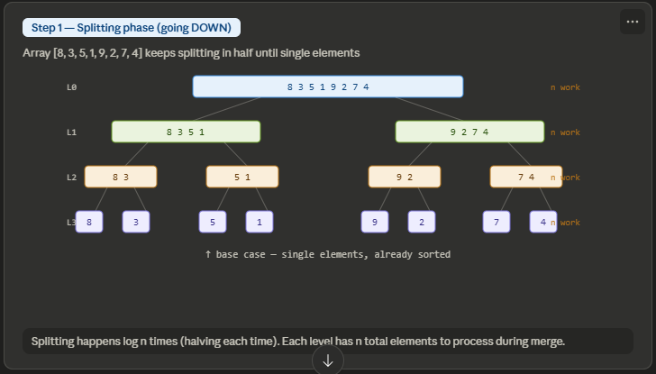
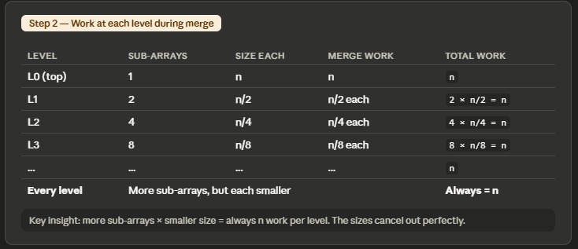
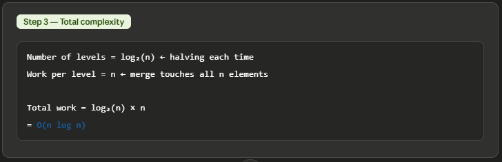
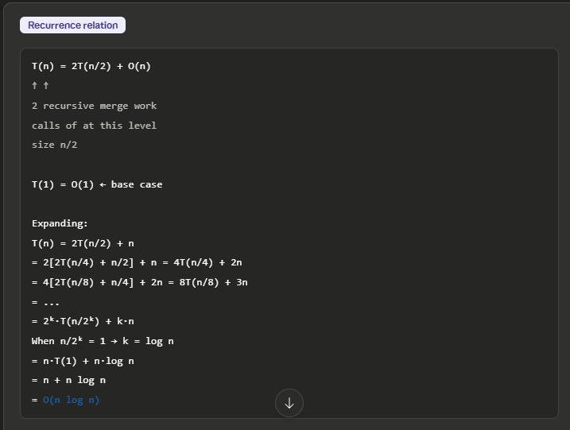
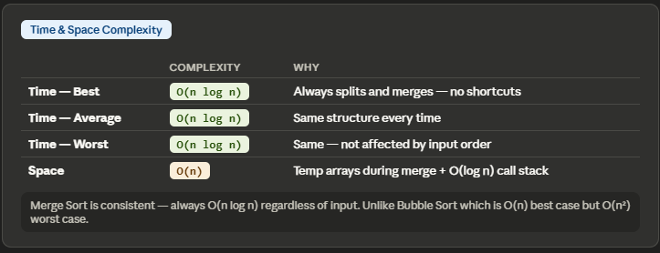
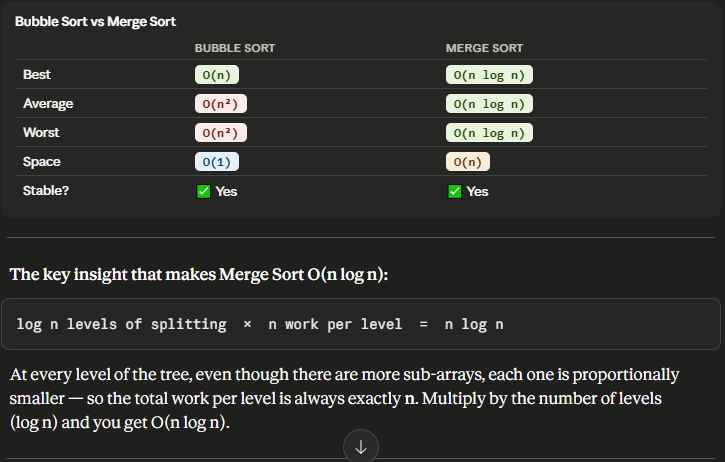
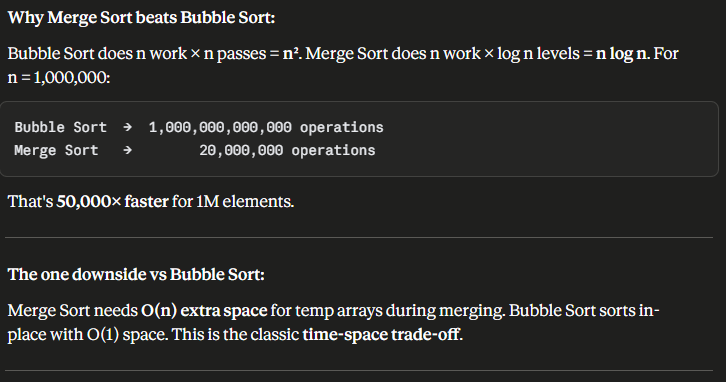

# code: 
```java
void mergeSort(int[] arr, int l, int r) {
    if (l >= r) return;                    // base case
    int mid = (l + r) / 2;
    mergeSort(arr, l, mid);               // left half
    mergeSort(arr, mid + 1, r);           // right half
    merge(arr, l, mid, r);               // merge both halves
}
```






