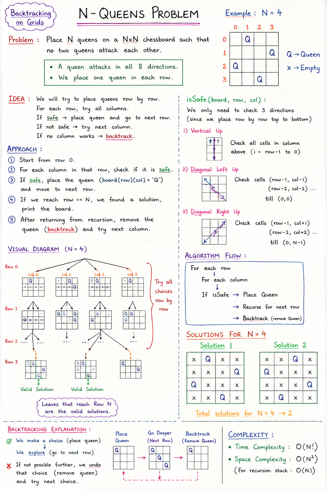

# N-Queens Problem (All Ways)

## Problem Statement

Place `N` queens on an `N × N` chessboard such that:

```text
No two queens attack each other
```

A queen can attack:
- Vertically
- Horizontally
- Diagonally

---

# Example (N = 4)

We need to place:

```text
4 queens on a 4 × 4 board
```

Valid solution example:

```text
x Q x x
x x x Q
Q x x x
x x Q x
```

Where:
- `Q` = Queen
- `x` = Empty cell

---

# Main Idea

We place queens:

```text
Row by row
```

For every row:
- Try every column
- Check if position is safe
- If safe → place queen
- Move to next row
- If no solution → remove queen (backtrack)

---

# Backtracking Concept

N-Queens is a classic:

```text
Choose → Explore → Undo
```

Pattern:

```java
Place Queen

Recursive Call

Remove Queen (Backtracking)
```

---

# What isSafe() Checks

Before placing a queen, we must check:

---

## 1. Vertical Up

Check all cells above current row.

```text
↑
↑
↑
```

---

## 2. Diagonal Left Up

Check upper-left diagonal.

```text
↖ ↖ ↖
```

---

## 3. Diagonal Right Up

Check upper-right diagonal.

```text
↗ ↗ ↗
```

---

# Why Only Upper Side?

Because:

```text
We place queens row by row from top to bottom
```

So queens only exist in previous rows.

No need to check below.

---
# Notes: 


# Java Code

```java
public class Backtracking {

    public static boolean isSafe(char board[][],
                                 int row,
                                 int col) {

        // Vertical Up
        for (int i = row - 1; i >= 0; i--) {
            if (board[i][col] == 'Q') {
                return false;
            }
        }

        // Diagonal Left Up
        for (int i = row - 1, j = col - 1;
             i >= 0 && j >= 0;
             i--, j--) {

            if (board[i][j] == 'Q') {
                return false;
            }
        }

        // Diagonal Right Up
        for (int i = row - 1, j = col + 1;
             i >= 0 && j < board.length;
             i--, j++) {

            if (board[i][j] == 'Q') {
                return false;
            }
        }

        return true;
    }

    public static void nQueens(char board[][],
                               int row) {

        // Base Case
        if (row == board.length) {
            printBoard(board);
            return;
        }

        // Try all columns
        for (int j = 0; j < board.length; j++) {

            if (isSafe(board, row, j)) {

                board[row][j] = 'Q';

                nQueens(board, row + 1);

                board[row][j] = 'x'; // Backtracking
            }
        }
    }

    // Print Board
    public static void printBoard(char board[][]) {

        System.out.println("------ Chess Board ------");

        for (int i = 0; i < board.length; i++) {

            for (int j = 0; j < board.length; j++) {
                System.out.print(board[i][j] + " ");
            }

            System.out.println();
        }
    }

    public static void main(String[] args) {

        int n = 4;

        char board[][] = new char[n][n];

        // Initialize board
        for (int i = 0; i < n; i++) {

            for (int j = 0; j < n; j++) {
                board[i][j] = 'x';
            }
        }

        nQueens(board, 0);
    }
}
```

---

# How Recursion Works

## Row 0

Try placing queen in:
- Column 0
- Column 1
- Column 2
- Column 3

---

## Row 1

Again try all columns.

If position unsafe:
```text
Skip it
```

If safe:
```text
Place queen and continue
```

---

# Backtracking Step

This line is the heart of backtracking:

```java
board[row][j] = 'x';
```

It means:

```text
Remove previously placed queen
Try next possibility
```

---

# Base Case

```java
if(row == board.length)
```

Meaning:

```text
All queens successfully placed
```

Then print board.

---

# Output for N = 4

## Solution 1

```text
x Q x x
x x x Q
Q x x x
x x Q x
```

---

## Solution 2

```text
x x Q x
Q x x x
x x x Q
x Q x x
```

---

# Total Solutions

For:

```text
N = 4
```

Total valid arrangements:

```text
2
```

---

# Time Complexity

Worst case:

```text
O(N!)
```

Because:
- First row → N choices
- Second row → N-1 choices
- Third row → N-2 choices
- ...

---

# Space Complexity

```text
O(N)
```

(for recursion stack)

Board itself uses:

```text
O(N²)
```
