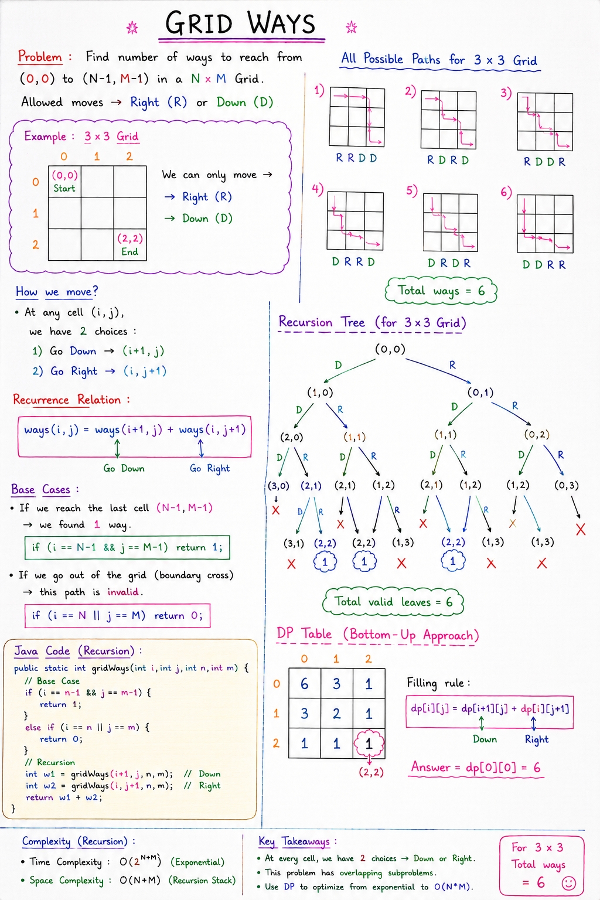

# Grid Ways

## Problem Statement

Find the number of ways to reach from:

```text
(0,0) → (N-1,M-1)
```

in an `N × M` grid.

Allowed moves:
- Right
- Down

---

# Example

For a `3 × 3` grid:

```text
Start = (0,0)
Destination = (2,2)
```

Grid representation:

```text
S  _  _
_  _  _
_  _  D
```

Where:
- `S` = Start
- `D` = Destination

---

# Allowed Moves

At every cell, we can move only:

```text
1. Right  → 
2. Down   ↓
```

No:
- Left
- Up
- Diagonal

---

# Main Idea

At every position:

```text
Either go RIGHT
OR
go DOWN
```

So recursion explores both possibilities.

---

# Recursive Formula

If we are standing at cell `(i,j)`:

```text
ways(i,j) =
ways(i+1,j) + ways(i,j+1)
```

Meaning:

```text
Total ways =
ways from DOWN +
ways from RIGHT
```

---
# Notes:


# Java Code

```java
/*
Grid Ways:

Find number of ways to reach from (0, 0)
to (N-1, M-1) in a NxM Grid.

Allowed moves:
- Right
- Down
*/

public class Backtracking {

    public static int gridWays(int i,
                               int j,
                               int n,
                               int m) {

        // Base Case
        if (i == n - 1 && j == m - 1) {
            return 1;
        }

        // Boundary Cross Condition
        else if (i == n || j == m) {
            return 0;
        }

        // Recursion
        int w1 = gridWays(i + 1, j, n, m);

        int w2 = gridWays(i, j + 1, n, m);

        return w1 + w2;
    }

    public static void main(String[] args) {

        int n = 3;
        int m = 3;

        System.out.println(gridWays(0, 0, n, m));
    }
}
```

---

# Base Cases

## 1. Destination Reached

```java
if(i == n-1 && j == m-1)
```

Meaning:

```text
Reached final cell
```

Return:

```text
1 valid path
```

---

## 2. Boundary Crossed

```java
else if(i == n || j == m)
```

Meaning:

```text
Moved outside grid
```

Return:

```text
0 ways
```

---

# Dry Run (3 × 3 Grid)

Start:

```text
gridWays(0,0)
```

From `(0,0)`:

```text
Go Down  → (1,0)
Go Right → (0,1)
```

Both recursive calls continue similarly.

---

# All Possible Paths

For `3 × 3`:

```text
RRDD
RDRD
RDDR
DRRD
DRDR
DDRR
```

Total:

```text
6 ways
```

---

# Output

```text
6
```

---

# Recursion Tree Idea

```text
                 (0,0)
                /     \
           down        right
            /             \
         (1,0)           (0,1)
          / \             / \
       ... ...         ... ...
```

Every node branches into:
- Right
- Down

---

# Time Complexity

Approximate complexity:

```text
O(2^(n+m))
```

Why?

Because:
- Every cell creates 2 recursive calls
- Many repeated calculations happen

This is exponential time complexity.

---

# Space Complexity

Maximum recursion depth:

```text
O(n + m)
```

---

# Important Observation

Many states are recalculated repeatedly.

Example:

```text
gridWays(1,1)
```

can be called multiple times.

This creates:

```text
Overlapping Subproblems
```

---

# DP Connection

This problem becomes very important in:

```text
Dynamic Programming (DP)
```

Because DP removes repeated recursive calls.

---

# Mathematical Trick (Optimized)

To reach destination:
- Need `(n-1)` down moves
- Need `(m-1)` right moves

Total moves:

```text
n + m - 2
```

Answer formula:

```text
(n+m-2)! / ((n-1)! × (m-1)!)
```

This is the combinatorics approach.

---

# Example (3 × 3)

```text
(4)! / (2! × 2!)

= 24 / 4

= 6
```

---

# What This Problem Teaches

Grid Ways teaches:

- Grid recursion
- Branching recursion
- Base cases
- Overlapping subproblems
- Foundation of Dynamic Programming
