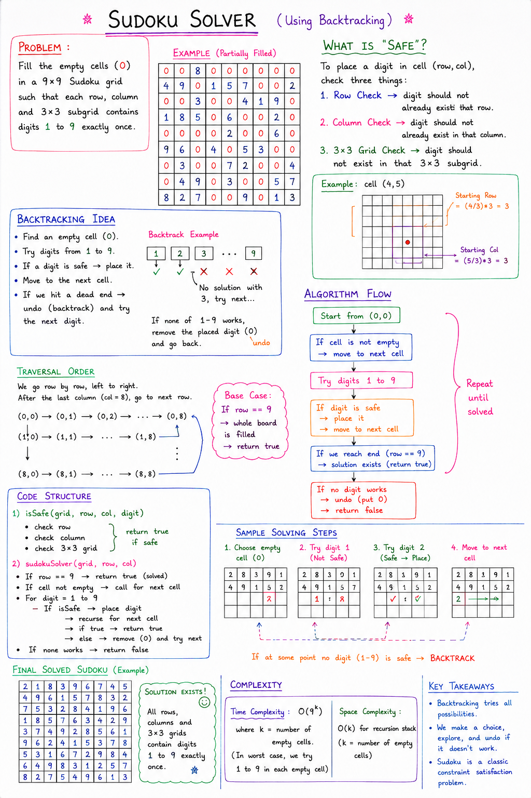

# Sudoku Solver Using Backtracking

## Problem Statement

Write a function to solve a Sudoku puzzle.

Rules of Sudoku:

- Each row must contain digits `1 → 9`
- Each column must contain digits `1 → 9`
- Each `3 × 3` subgrid must contain digits `1 → 9`
- No repetition allowed

Empty cells are represented using:

```text
0
```

---

# Example Sudoku

```text
0 0 8 0 0 0 0 0 0
4 9 0 1 5 7 0 0 2
0 0 3 0 0 4 1 9 0
1 8 5 0 6 0 0 2 0
0 0 0 0 2 0 0 6 0
9 6 0 4 0 5 3 0 0
0 3 0 0 7 2 0 0 4
0 4 9 0 3 0 0 5 7
8 2 7 0 0 9 0 1 3
```

---

# Main Idea

We solve Sudoku using:

```text
Backtracking
```

At every empty cell:

```text
Try digits 1 → 9
```

If a digit is safe:
- Place it
- Recurse for next cell

If no digit works:
- Remove previously placed digit
- Try another possibility

This is called:

```text
Backtracking
```

---

# Core Backtracking Pattern

```java
Place digit

Recursive call

Remove digit (Backtrack)
```

or

```text
Choose → Explore → Undo
```

---

# What isSafe() Checks

Before placing a digit, we must check:

---

## 1. Row Check

Digit should not already exist in current row.

```java
sudoku[row][j] == digit
```

---

## 2. Column Check

Digit should not already exist in current column.

```java
sudoku[i][col] == digit
```

---

## 3. 3×3 Grid Check

Digit should not already exist in current subgrid.

---

# Finding Starting Cell of 3×3 Grid

```java
int sr = (row/3) * 3;
int sc = (col/3) * 3;
```

Where:
- `sr` = starting row
- `sc` = starting column

Example:

If cell is:

```text
(4,5)
```

Then:

```text
sr = (4/3)*3 = 3
sc = (5/3)*3 = 3
```

So subgrid starts at:

```text
(3,3)
```

---
# Notes: 


Note: diagramatical mistake in `Sample Solving Steps`

---

# Java Code


```java
/*
Write a function to complete a sudoku.
*/

public class Backtracking {

    public static boolean isSafe(int sudoku[][],
                                 int row,
                                 int col,
                                 int digit) {

        // Column Check
        for (int i = 0; i <= 8; i++) {

            if (sudoku[i][col] == digit) {
                return false;
            }
        }

        // Row Check
        for (int j = 0; j <= 8; j++) {

            if (sudoku[row][j] == digit) {
                return false;
            }
        }

        // Grid Check
        int sr = (row / 3) * 3;
        int sc = (col / 3) * 3;

        // 3×3 Grid
        for (int i = sr; i < sr + 3; i++) {

            for (int j = sc; j < sc + 3; j++) {

                if (sudoku[i][j] == digit) {
                    return false;
                }
            }
        }

        return true;
    }

    public static boolean sudokuSolver(int sudoku[][],
                                       int row,
                                       int col) {

        // Base Case
        if (row == 9) {
            return true;
        }

        // Next Cell
        int nextRow = row;
        int nextCol = col + 1;

        if (col + 1 == 9) {
            nextRow = row + 1;
            nextCol = 0;
        }

        // Already Filled Cell
        if (sudoku[row][col] != 0) {
            return sudokuSolver(sudoku,
                                nextRow,
                                nextCol);
        }

        // Try Digits 1 → 9
        for (int digit = 1; digit <= 9; digit++) {

            if (isSafe(sudoku,
                       row,
                       col,
                       digit)) {

                sudoku[row][col] = digit;

                if (sudokuSolver(sudoku,
                                 nextRow,
                                 nextCol)) {

                    return true;
                }

                // Backtracking
                sudoku[row][col] = 0;
            }
        }

        return false;
    }

    // Print Sudoku
    public static void printSudoku(int sudoku[][]) {

        for (int i = 0; i < 9; i++) {

            for (int j = 0; j < 9; j++) {

                System.out.print(sudoku[i][j] + " ");
            }

            System.out.println();
        }
    }

    public static void main(String[] args) {

        int sudoku[][] = {
            {0,0,8,0,0,0,0,0,0},
            {4,9,0,1,5,7,0,0,2},
            {0,0,3,0,0,4,1,9,0},
            {1,8,5,0,6,0,0,2,0},
            {0,0,0,0,2,0,0,6,0},
            {9,6,0,4,0,5,3,0,0},
            {0,3,0,0,7,2,0,0,4},
            {0,4,9,0,3,0,0,5,7},
            {8,2,7,0,0,9,0,1,3}
        };

        if (sudokuSolver(sudoku, 0, 0)) {

            System.out.println("solution exists");

            printSudoku(sudoku);

        } else {

            System.out.println("solution does not exist");
        }
    }
}
```

---

# How Recursion Works

Traversal order:

```text
Left → Right
Then next row
```

Example:

```text
(0,0) → (0,1) → (0,2)
...
(1,0) → (1,1)
```

---

# Backtracking Step

This line is the heart of Sudoku backtracking:

```java
sudoku[row][col] = 0;
```

Meaning:

```text
Undo previously placed digit
Try another digit
```

---

# Base Case

```java
if(row == 9)
```

Meaning:

```text
Entire Sudoku solved
```

Return:

```text
true
```

---

# Output

```text
solution exists
```

Solved Sudoku:

```text
2 1 8 3 9 6 7 4 5
4 9 6 1 5 7 8 3 2
7 5 3 2 8 4 1 9 6
1 8 5 7 6 3 4 2 9
3 7 4 9 2 8 5 6 1
9 6 2 4 1 5 3 7 8
5 3 1 6 7 2 9 8 4
6 4 9 8 3 1 2 5 7
8 2 7 5 4 9 6 1 3
```

---

# Time Complexity

Worst-case complexity:

```text
O(9^(n*n))
```

because:
- Every empty cell can try digits `1 → 9`

But practical performance is much better because invalid paths get pruned early.

---

# Space Complexity

Recursion stack space:

```text
O(n*n)
```

---

# Important Concepts Learned

Sudoku teaches:

- Constraint-based backtracking
- Recursive search
- State restoration
- Grid traversal
- Pruning invalid paths
