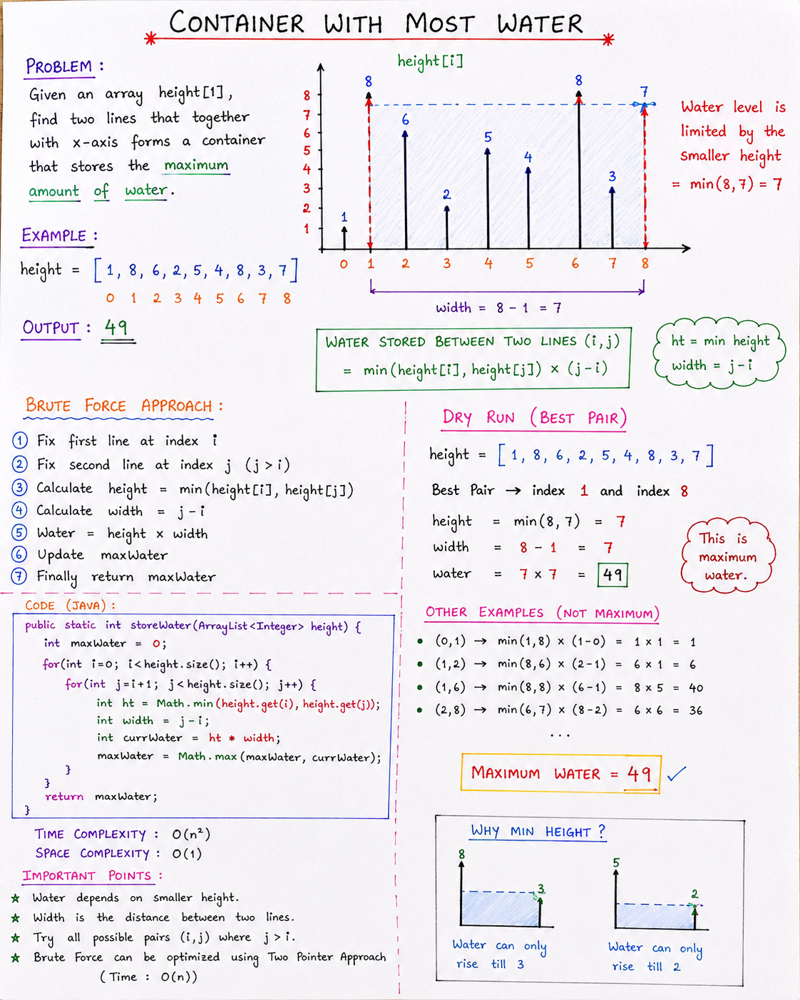

# Container With Most Water (Brute Force) - Explanation Notes

## Problem Statement

Given an array:

~~~java
height = [1,8,6,2,5,4,8,3,7]
~~~

Each value represents the height of a vertical line.

Goal:
> Find two lines that can store the maximum amount of water.

---

# Visual Understanding

Example:

```
Index:   0 1 2 3 4 5 6 7 8
Height: [1,8,6,2,5,4,8,3,7]
``` 

We choose two lines:
- Left line
- Right line

These two lines form a container.

---

# Formula Used

~~~java
Water = min(height[i], height[j]) * (j - i)
~~~

Where:

| Part | Meaning |
|------|---------|
| min(height[i], height[j]) | Container height |
| (j - i) | Width between lines |

---

# Why Minimum Height?

Because:
> Water can only rise till the shorter wall.

Example:

~~~java
[8,3]
~~~

Water level:
~~~java
3
~~~

Not 8.

---

# Brute Force Approach

Idea:
> Check every possible pair of lines.

For every pair:
1. Find minimum height
2. Find width
3. Calculate current water
4. Update maximum water

---

# Algorithm

## Step 1
Take first line using `i`

## Step 2
Take second line using `j`

## Step 3
Calculate:
~~~java
height = min(height[i], height[j])
~~~

## Step 4
Calculate:
~~~java
width = j - i
~~~

## Step 5
Calculate:
~~~java
currWater = height * width
~~~

## Step 6
Update maximum:
~~~java
maxWater = Math.max(maxWater, currWater)
~~~

---
# Notes: 


# Code

~~~java
import java.util.ArrayList;

public class Main {

    public static int storeWater(ArrayList<Integer> height) {

        int maxWater = 0;

        // Brute Force Approach
        for(int i = 0; i < height.size(); i++) {

            for(int j = i + 1; j < height.size(); j++) {

                int ht = Math.min(height.get(i), height.get(j));

                int width = j - i;

                int currWater = ht * width;

                maxWater = Math.max(maxWater, currWater);
            }
        }

        return maxWater;
    }

    public static void main(String[] args) {

        ArrayList<Integer> height = new ArrayList<>();

        height.add(1);
        height.add(8);
        height.add(6);
        height.add(2);
        height.add(5);
        height.add(4);
        height.add(8);
        height.add(3);
        height.add(7);

        System.out.println(storeWater(height));
    }
}
~~~

---

# Output

~~~java
49
~~~

---

# Dry Run of Maximum Answer

Best pair:
~~~java
8 and 7
~~~

Indexes:
~~~java
1 and 8
~~~

Height:
~~~java
min(8,7) = 7
~~~

Width:
~~~java
8 - 1 = 7
~~~

Water:
~~~java
7 * 7 = 49
~~~

Maximum Water:
~~~java
49
~~~

---

# Time Complexity

Two nested loops:

~~~java
for(i)
   for(j)
~~~

Total complexity:

~~~java
O(n²)
~~~

Because every pair is checked.

---

# Space Complexity

~~~java
O(1)
~~~

No extra space used.

---

# Important Concepts

## 1. Math.min()

~~~java
Math.min(a, b)
~~~

Returns smaller value.

---

## 2. Math.max()

~~~java
Math.max(a, b)
~~~

Returns larger value.

---

# Why Brute Force is Slow?

Because:
- Every pair is checked
- Many repeated calculations happen

For large arrays:
~~~java
O(n²)
~~~

becomes slow.

---

# Optimization

This problem can be optimized using:
> Two Pointer Approach

Complexity improves:

~~~java
O(n²) → O(n)
~~~

---

# Important Interview Points

- Water depends on smaller height
- Width = distance between indices
- Brute force checks all pairs
- Uses nested loops
- Time complexity is high

---

# Final Summary

Container With Most Water (Brute Force):

- Try every pair of lines
- Calculate water stored
- Keep track of maximum water

Formula:

~~~java
Water = min(height[i], height[j]) * (j - i)
~~~