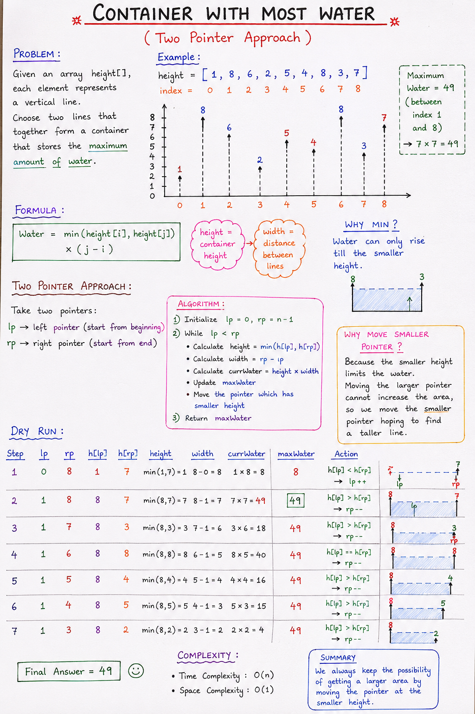

# Container With Most Water (Two Pointer Approach) - Complete Notes

## Problem Statement

Given an array:

~~~java
height = [1,8,6,2,5,4,8,3,7]
~~~

Each value represents the height of a vertical line.

Goal:
> Find two lines that together store the maximum amount of water.

---

# Formula Used

~~~java
Water = min(height[i], height[j]) * (j - i)
~~~

Where:

| Part | Meaning |
|------|---------|
| min(height[i], height[j]) | Container height |
| (j - i) | Width between lines |

---

# Why Minimum Height?

Because:
> Water can rise only till the smaller wall.

Example:

~~~java
[8,3]
~~~

Water stored:
~~~java
3
~~~

Not 8.

---

# Two Pointer Approach

Instead of checking every pair:
- Use two pointers
- One at beginning
- One at end

This reduces complexity from:
~~~java
O(n²) → O(n)
~~~

---

# Main Idea

1. Start with maximum width
2. Calculate current water
3. Move the smaller height pointer
4. Continue until pointers meet

---

# Why Move Smaller Pointer?

Suppose:

~~~java
height[lp] < height[rp]
~~~

Current water depends on:
~~~java
height[lp]
~~~

Even if width decreases,
we need a taller height to possibly increase area.

So:
~~~java
lp++
~~~

Because:
> Moving larger pointer cannot help if smaller height remains limiting factor.

---

# Algorithm

## Step 1
Initialize:

~~~java
lp = 0
rp = n - 1
~~~

---

## Step 2
While:

~~~java
lp < rp
~~~

Calculate:
- Height
- Width
- Current Water
- Maximum Water

---

## Step 3
Move smaller height pointer

~~~java
if(height[lp] < height[rp])
    lp++;
else
    rp--;
~~~

---
# Notes:

# Code

~~~java
import java.util.ArrayList;

public class Main {

    public static int storeWater(ArrayList<Integer> height) {

        int maxWater = 0;

        int lp = 0;
        int rp = height.size() - 1;

        // Two Pointer Approach
        while(lp < rp) {

            // Calculate water area
            int ht = Math.min(height.get(lp), height.get(rp));

            int width = rp - lp;

            int currWater = ht * width;

            maxWater = Math.max(maxWater, currWater);

            // Update pointers
            if(height.get(lp) < height.get(rp)) {
                lp++;
            } else {
                rp--;
            }
        }

        return maxWater;
    }

    public static void main(String[] args) {

        ArrayList<Integer> height = new ArrayList<>();

        height.add(1);
        height.add(8);
        height.add(6);
        height.add(2);
        height.add(5);
        height.add(4);
        height.add(8);
        height.add(3);
        height.add(7);

        System.out.println(storeWater(height));
    }
}
~~~

---

# Output

~~~java
49
~~~

---

# Dry Run

Initial:

~~~java
lp = 0
rp = 8
~~~

Heights:

~~~java
1 and 7
~~~

Water:

~~~java
min(1,7) * 8 = 8
~~~

Move smaller pointer:
~~~java
lp++
~~~

---

Now:

~~~java
lp = 1
rp = 8
~~~

Heights:

~~~java
8 and 7
~~~

Water:

~~~java
min(8,7) * 7
= 7 * 7
= 49
~~~

Maximum Water:
~~~java
49
~~~

---

# Time Complexity

Each pointer moves only once.

So:

~~~java
O(n)
~~~

---

# Space Complexity

~~~java
O(1)
~~~

No extra space used.

---

# Brute Force vs Two Pointer

| Approach | Time Complexity |
|-----------|----------------|
| Brute Force | O(n²) |
| Two Pointer | O(n) |

---

# Important Concepts

## 1. Two Pointer Technique

Used when:
- Array problems
- Opposite direction traversal
- Optimized searching

---

## 2. Greedy Logic

Move the smaller height pointer because:
- Smaller wall limits water
- Need possibility of taller wall

---

# Important Interview Points

- Start with maximum width
- Water depends on smaller height
- Move smaller pointer only
- Optimized solution = O(n)

---

# Final Summary

Two Pointer Approach:

- Start from both ends
- Calculate water area
- Move smaller height pointer
- Keep updating maximum water

Formula:

~~~java
Water = min(height[i], height[j]) * (j - i)
~~~

Best Complexity:

~~~java
Time  = O(n)
Space = O(1)
~~~