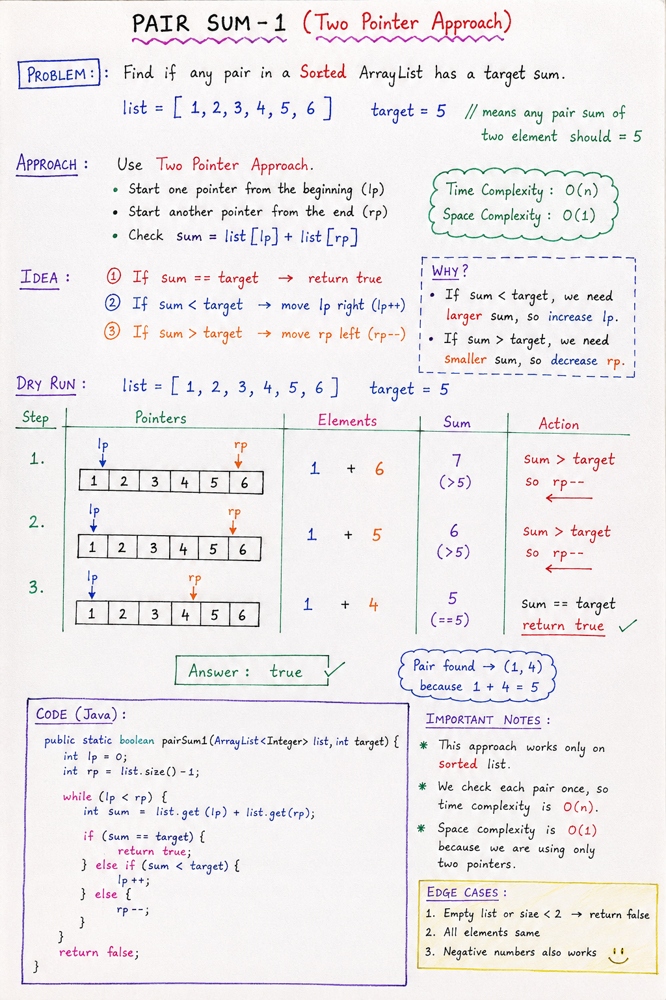

# Pair Sum - 1 (Two Pointer Approach)

## Problem Statement

Given a **sorted ArrayList**, find whether there exists a pair of elements whose sum equals a given target.

**Example:**

```
list   = [1, 2, 3, 4, 5, 6]
target = 5
output = true  (because 1+4=5 or 2+3=5)
```

---

## Key Idea

Since the array is **sorted**, we can use the **Two Pointer Technique** instead of checking all pairs.

This reduces complexity from:

- Brute Force → O(n²)
- Two Pointer → **O(n)**

---

## Two Pointer Approach

### Step 1: Initialize pointers

- `lp` → starts from beginning (index 0)
- `rp` → starts from end (index n-1)

```
lp → [1, 2, 3, 4, 5, 6] ← rp
```

### Step 2: Check sum

```
sum = list[lp] + list[rp]
```

### Step 3: Move pointers based on sum

**Case 1: sum == target**
```
return true
```

**Case 2: sum < target**
```
lp++
```
We need a bigger sum → move left pointer right.

**Case 3: sum > target**
```
rp--
```
We need a smaller sum → move right pointer left.

---

## Loop Condition

```java
while (lp < rp)
```

We stop when pointers cross.

---


## Java Code

```java
public static boolean pairSum1(ArrayList<Integer> list, int target) {
    int lp = 0;
    int rp = list.size() - 1;

    while (lp < rp) {
        int sum = list.get(lp) + list.get(rp);

        if (sum == target) {
            return true;
        } else if (sum < target) {
            lp++;
        } else {
            rp--;
        }
    }

    return false;
}
```

---

## Dry Run

`list = [1, 2, 3, 4, 5, 6]`, `target = 5`

| lp | rp | sum | Action |
|----|-----|-----|--------|
| 0 (1) | 5 (6) | 7 | sum > target → rp-- |
| 0 (1) | 4 (5) | 6 | sum > target → rp-- |
| 0 (1) | 3 (4) | 5 | sum == target → return true ✅ |

---

## Complexity Analysis

**Time Complexity: O(n)**
Each element is visited at most once.

**Space Complexity: O(1)**
No extra space used.

---

## Important Notes

- Works only on **sorted** arrays
- Efficient for large datasets
- One of the most important DSA patterns

---

## Pattern Summary

> If array is sorted + pair/sum problem → **think Two Pointers**