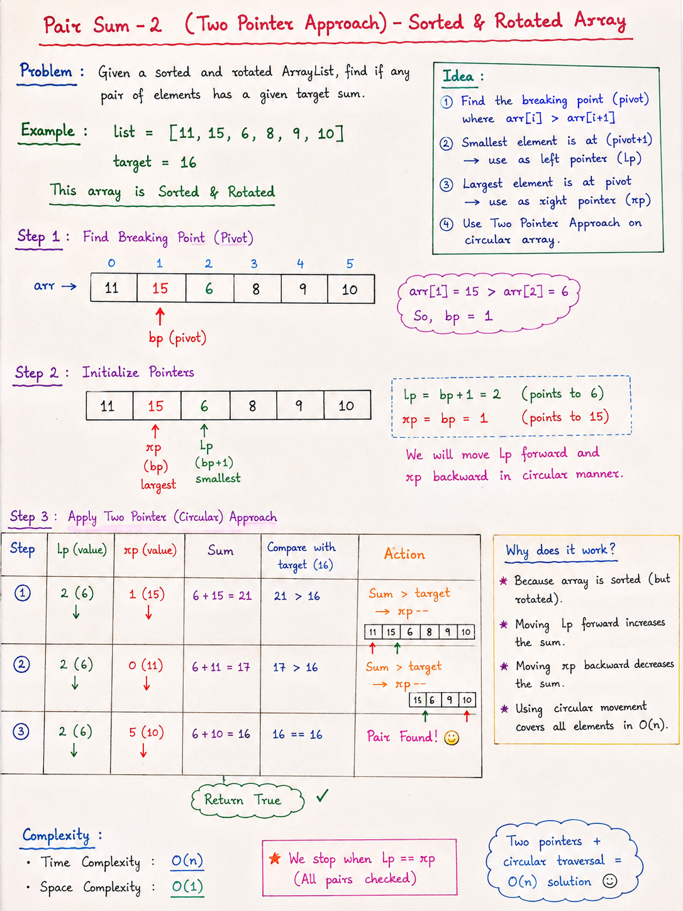

# Pair Sum - 2 (Two Pointer Approach)
## Sorted & Rotated ArrayList

---

## Problem Statement

Given a **sorted and rotated ArrayList**, determine whether there exists a pair of elements whose sum equals a given target.

**Example:**

```
list   = [11, 15, 6, 8, 9, 10]
target = 16
output = true  (because 6 + 10 = 16)
```

---

## Key Idea

We cannot directly use normal two pointers because the array is **rotated**.

So we:
1. Find the **pivot (breaking point)**
2. Treat array as a **circular sorted array**
3. Apply **Two Pointer Technique**

---
# Notes:


# Code:

```java
/*
Pair Sum -2 
Find if any pair in a Sorted & Rotated ArrayList has a target sum.

list = [11, 15, 6, 8, 9, 10]
target = 16

Solved using (Two Pointer Approach) -- Time Complexity: O(n)
*/

import java.util.ArrayList;

public class Main {
  public static boolean pairSum2(ArrayList<Integer> list, int target) {
    int bp = -1; // breaking point to find pivot point
    int n = list.size();

    for (int i=0; i<n-1; i++) {
      if(list.get(i) > list.get(i+1)) {
        bp = i;
        break;
      }
    }

    int lp = bp+1; // smallest element (left-pointer)
    int rp = bp; // largest element (right-pointer)

    while(lp != rp) {
      // case1
      if(list.get(lp) + list.get(rp) == target) {
        return true;
      }

      // case 2: 
      if(list.get(lp) + list.get(rp) < target) {
        lp = (lp+1) % n;
      } else {
        // case 3: 
        rp = (n+rp-1) % n;
      }
    }

    return false;
  }
  public static void main(String[] args) {
    ArrayList<Integer> list = new ArrayList<>();
    // 11, 15, 6, 8, 9, 10 -- Sorted & Rotated
    list.add(11);
    list.add(15);
    list.add(6);
    list.add(8);
    list.add(9);
    list.add(10);

    int target = 16;

    System.out.println(pairSum2(list, target));
  }
}

```

## Step 1: Find Pivot (Breaking Point)

Pivot is the index where:

```
arr[i] > arr[i+1]
```

**Example:**

```
[11, 15, 6, 8, 9, 10]
      ↑
   pivot (15 > 6)
```

Pivot index = 1

---

## Step 2: Initialize Two Pointers

After finding pivot:

- `lp = pivot + 1` → points to smallest element
- `rp = pivot` → points to largest element

```
lp → 6     rp → 15
```

---

## Step 3: Circular Two Pointer Approach

We use modulo `% n` to simulate circular movement.

| Condition | Action |
|-----------|--------|
| sum == target | return true |
| sum < target | move lp forward |
| sum > target | move rp backward |

**Forward movement (lp):**

```
lp = (lp + 1) % n
```

**Backward movement (rp):**

```
rp = (n + rp - 1) % n
```

---

## Why This Works

- Array is **sorted but rotated**
- Circular traversal restores sorted order
- Two pointers then simulate normal sorted array behavior

---

## Complexity

- **Time Complexity:** O(n)
- **Space Complexity:** O(1)

---

## Algorithm Summary

```
1. Find pivot
2. Set lp = pivot + 1, rp = pivot
3. While lp != rp:
     - compute sum = arr[lp] + arr[rp]
     - if sum == target → return true
     - if sum < target  → lp = (lp + 1) % n
     - else             → rp = (n + rp - 1) % n
4. return false
```

---

## Final Insight

- Treat rotated array like a **circular sorted array**
- Then apply classic **two-pointer technique**

---

## Interview Tip

If asked: *"How do you solve Pair Sum in a rotated sorted array?"*

Answer:
- Find the pivot
- Use circular two pointers
- Apply sorted array logic