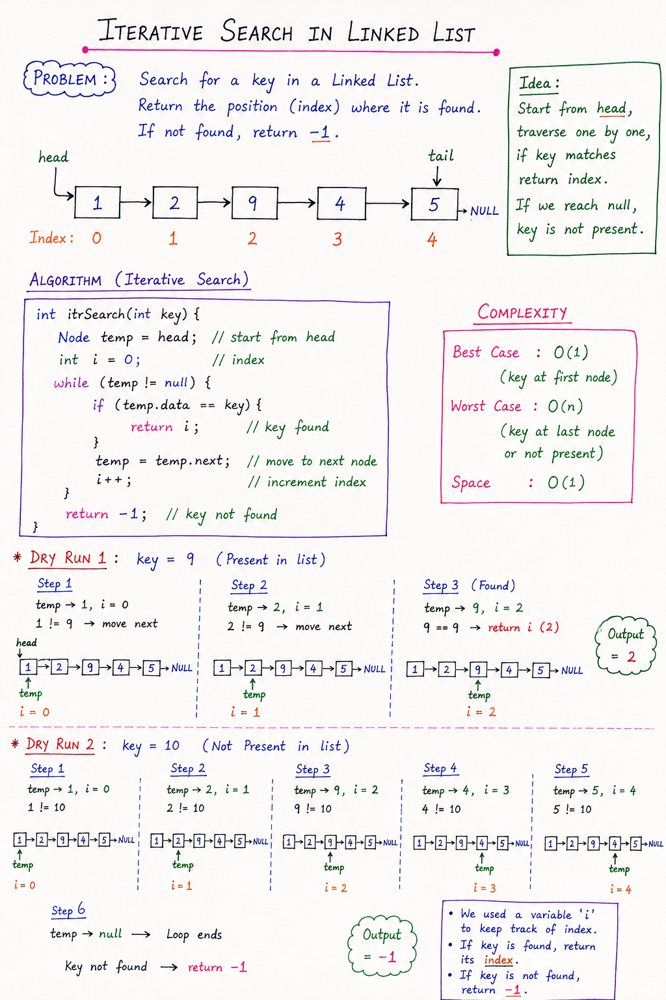

# Iterative Search in Linked List (DSA Notes)

## 📌 Problem Statement
Given the head of a singly linked list, search for a given `key` and return its **index (position)**.

- If the key is found → return its index (0-based)
- If not found → return `-1`

---

## 💡 Idea (Intuition)
We start from the **head node** and move one by one using `next` pointer.

At each node:
- Compare `node.data` with `key`
- If match → return current index
- Else → move forward

If we reach `null` → key does not exist.

---
# Notes:


## ⚙️ Algorithm (Iterative Search)

### Steps:
1. Initialize `temp = head`
2. Initialize index `i = 0`
3. While `temp != null`:
   - If `temp.data == key` → return `i`
   - Move `temp = temp.next`
   - Increment `i++`
4. If loop ends → return `-1`

---

## 🧾 Java Code

~~~java
public int itrSearch(int key) {
    Node temp = head;
    int i = 0;

    while (temp != null) {
        if (temp.data == key) {
            return i;   // key found
        }
        temp = temp.next;
        i++;
    }

    return -1;  // key not found
}
~~~

---

## 🔍 Example

Linked List:
```
1 → 2 → 9 → 4 → 5 → null
```

### Case 1: key = 9
| Node | Value | Index | Result |
|------|-------|-------|--------|
| 1st  | 1     | 0     | ❌ |
| 2nd  | 2     | 1     | ❌ |
| 3rd  | 9     | 2     | ✅ return 2 |

Output: `2`

---

### Case 2: key = 10
Traverse full list → not found

Output: `-1`

---

## ⏱️ Complexity Analysis

### Time Complexity:
- Best Case: **O(1)** (first node match)
- Worst Case: **O(n)** (last node or not found)

### Space Complexity:
- **O(1)** (no extra space used)

---

## 🧠 Key Points to Remember
- Always traverse using a temporary pointer (`temp`)
- Index starts from `0`
- Return `-1` if element is absent
- Simple linear traversal = O(n)

---

## 🚀 Summary
Iterative search in a linked list is a **linear traversal technique** where we move node by node until we find the key or reach the end of the list.