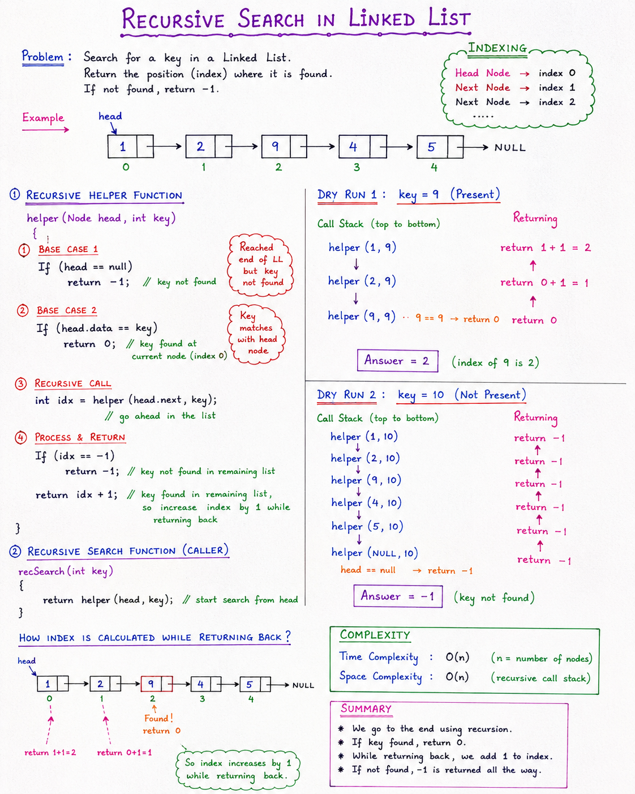

# Recursive Search in Linked List

## 📌 Problem Statement

Search for a key in a Linked List using **Recursion**.

- Return the index if the key is found.
- Return `-1` if the key is not found.

### Example

~~~java
1 -> 2 -> 9 -> 4 -> 5 -> null
Key = 9

Output = 2
~~~

---

## 📌 Approach

Instead of using a loop, recursively move to the next node until:

1. Key is found.
2. End of the Linked List is reached.

While returning back from recursion, calculate the index.

---
# Note:

## 📌 Code

~~~java
// Helper Function
public int helper(Node head, int key) {

    if(head == null) {
        return -1;
    }

    if(head.data == key) {
        return 0;
    }

    int idx = helper(head.next, key);

    if(idx == -1) {
        return -1;
    }

    return idx + 1;
}

// Recursive Search
public int recSearch(int key) {
    return helper(head, key);
}
~~~

---

## 📌 How It Works

### Base Case 1

~~~java
if(head == null)
    return -1;
~~~

Reached the end of the list.

Key not found.

---

### Base Case 2

~~~java
if(head.data == key)
    return 0;
~~~

Key found at current node.

Return `0`.

---

### Recursive Call

~~~java
int idx = helper(head.next, key);
~~~

Move to the next node and continue searching.

---

### Return Statement

~~~java
if(idx == -1)
    return -1;

return idx + 1;
~~~

- If key is not found ahead, return `-1`.
- If key is found, add `1` while returning back.

---

## 📌 Dry Run

### Search Key = 9

~~~java
helper(1,9)
↓
helper(2,9)
↓
helper(9,9)
~~~

At node `9`:

~~~java
return 0;
~~~

Returning back:

~~~java
Node 2 -> 0 + 1 = 1
Node 1 -> 1 + 1 = 2
~~~

Final Answer:

~~~java
2
~~~

---

## 📌 Key Not Present

### Search Key = 10

~~~java
helper(1,10)
↓
helper(2,10)
↓
helper(9,10)
↓
helper(4,10)
↓
helper(5,10)
↓
helper(null,10)
~~~

~~~java
return -1;
~~~

All previous calls also return:

~~~java
-1
~~~

Final Answer:

~~~java
-1
~~~

---

## 📌 Time & Space Complexity

~~~java
Time Complexity  = O(n)
Space Complexity = O(n)
~~~

- `O(n)` time because every node is visited once.
- `O(n)` space because of the recursive call stack.

---

## 📌 Summary

- Recursively search each node.
- Return `0` when key is found.
- Return `-1` when end of list is reached.
- Add `1` while returning back to calculate the index.
- Time Complexity = `O(n)`
- Space Complexity = `O(n)`

### Remember

~~~java
Key Found      -> return 0
Not Found      -> return -1
Otherwise      -> return idx + 1
~~~