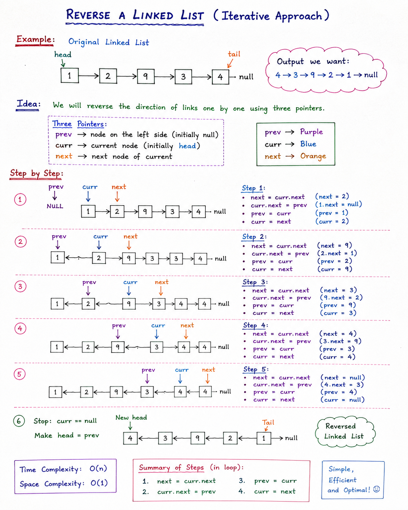

# Reverse a Linked List (Iterative Approach)

## 📌 Problem Statement

Given the head of a singly linked list, reverse the linked list and return the new head.

### Example

Original Linked List:
```
1 --> 2 --> 9 --> 3 --> 4 --> null
```
Output:

4 --> 3 --> 9 --> 2 --> 1 --> null

---

# 💡 Main Idea

In a singly linked list, every node points to the next node.

To reverse the linked list, we need to reverse the direction of every link.

Before:
```
1 --> 2 --> 9 --> 3 --> 4 --> null
```
After:
```
1 <-- 2 <-- 9 <-- 3 <-- 4
```
which becomes:

4 --> 3 --> 9 --> 2 --> 1 --> null

---


# 🔑 Three Pointer Approach

To reverse the links safely, we use three pointers:

### 1. prev

Points to the node on the left side of current node.

Initially:

`prev = null`

### 2. curr

Represents the current node being processed.

Initially:

`curr = head`

### 3. next

Stores the next node of current node before changing links.

Initially:

`next = curr.next`

---

# 🎯 Why Do We Need next?

Suppose:
```
1 --> 2 --> 9 --> null
```
Current node is 1.

If we directly do:

`curr.next = prev`

Then:

`1 --> null`

The connection to node 2 is lost forever.

Therefore before changing links we save:

`next = curr.next`

This preserves the remaining linked list.

---

# 🔄 Algorithm

While curr is not null:

### Step 1

Store next node

`next = curr.next`

### Step 2

Reverse the link

`curr.next = prev`

### Step 3

Move prev one step ahead

`prev = curr`

### Step 4

Move curr one step ahead

`curr = next`

Repeat until curr becomes null.

Finally:

`head = prev`

because prev will be standing at the last node, which becomes the new head.

---

# 📝 Dry Run

Initial Linked List:
```
1 --> 2 --> 9 --> 3 --> 4 --> null
```
Initial Values:

`prev = null`
`curr = 1`

---

## Iteration 1

`next = 2`

Reverse link:

`1 --> null`

Move pointers:

`prev = 1`
`curr = 2`

Result:
```
null <-- 1    2 --> 9 --> 3 --> 4
```
---

## Iteration 2

`next = 9`

Reverse link:

`2 --> 1`

Move pointers:

`prev = 2`
`curr = 9`

Result:
```
null <-- 1 <-- 2    9 --> 3 --> 4
```
---

## Iteration 3

`next = 3`

Reverse link:

`9 --> 2`

Move pointers:

`prev = 9`
`curr = 3`

Result:
```
null <-- 1 <-- 2 <-- 9      3 --> 4
```
---

## Iteration 4

`next = 4`

Reverse link:

`3 --> 9`

Move pointers:

`prev = 3`
`curr = 4`

Result:
```
null <-- 1 <-- 2 <-- 9 <-- 3      4
```
---

## Iteration 5

`next = null
`
Reverse link:

`4 --> 3`

Move pointers:

prev = 4
`curr = null`

Result:
```
null <-- 1 <-- 2 <-- 9 <-- 3 <-- 4
```
Loop ends because curr == null.

---

# 🎉 Final Step

Make head point to prev.

`head = prev`

New Linked List:
```
4 --> 3 --> 9 --> 2 --> 1 --> null
```
---

# ✅ Java Implementation

~~~java
public void reverse() {
    Node prev = null;
    Node curr = tail = head;
    Node next;

    while(curr != null) {
        next = curr.next;
        curr.next = prev;
        prev = curr;
        curr = next;
    }

    head = prev;
}