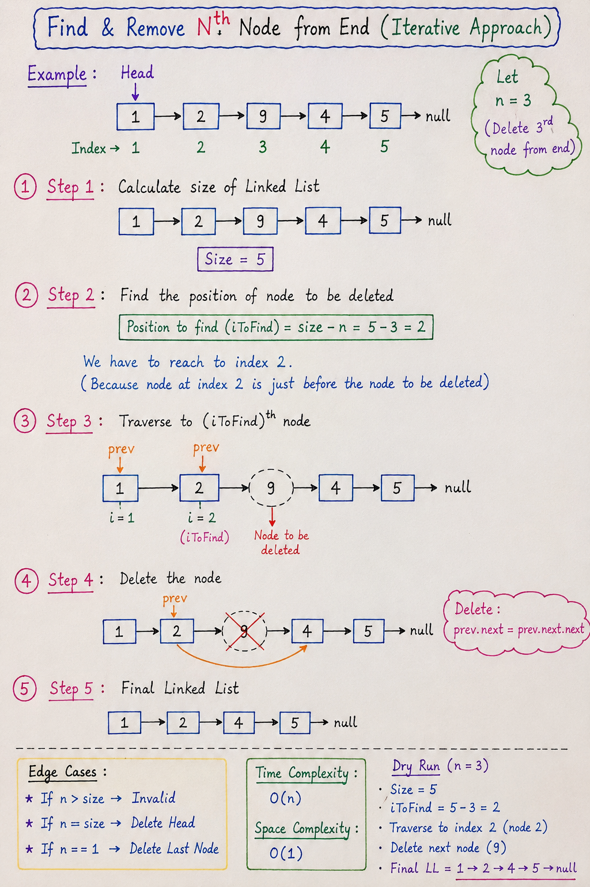

# Find & Remove Nth Node from End (Iterative Approach)

## 📌 Problem Statement
Given a singly linked list, remove the **Nth node from the end** of the list and return the updated list.

We are using an **iterative 2-pass approach**.

---

## 📌 Example

### Input:
1 → 2 → 9 → 4 → 5 → NULL  
n = 3

### Output:
1 → 2 → 4 → 5 → NULL  

(9 is removed because it is 3rd from the end)

---

## 🧠 Approach (Step-by-Step)

We solve this in **4 simple steps**:

---
# Note:

## ✅ Step 1: Calculate Size of Linked List

We first traverse the list and count total nodes.

### Example:
1 → 2 → 9 → 4 → 5 → NULL  

Size = 5

---

## ✅ Step 2: Find Position from Start

We convert "Nth from end" into "position from start".

### Formula:
~~~text
position = size - n
~~~

### Example:
~~~text
position = 5 - 3 = 2
~~~

So we need to go to **2nd node (just before deletion point)**

---

## ✅ Step 3: Traverse to (position - 1)

We move a pointer `prev` to just before the node we want to delete.

### Example:
We stop at node:
1 → 2 (prev) → 9 → 4 → 5

---

## ✅ Step 4: Delete Node

We simply skip the node:

~~~text
prev.next = prev.next.next
~~~

### After deletion:
1 → 2 → 4 → 5 → NULL

---

## ⚠️ Edge Cases

- If `n > size` → Invalid input
- If `n == size` → Delete head
- If `n == 1` → Delete last node

---

## ⏱ Complexity

- Time Complexity: **O(n)**
- Space Complexity: **O(1)**

---

## 💻 Java Code

~~~java
public class LinkedList {

  public static class Node {
    int data;
    Node next;

    Node(int data) {
      this.data = data;
      this.next = null;
    }
  }

  public static Node head;
  public static Node tail;

  public void deleteNthFromEnd(int n) {

    // Step 1: calculate size
    int size = 0;
    Node temp = head;

    while (temp != null) {
      temp = temp.next;
      size++;
    }

    // Edge case: invalid n
    if (n > size || n <= 0) {
      System.out.println("Invalid n");
      return;
    }

    // Step 2: delete head
    if (n == size) {
      head = head.next;
      if (head == null) tail = null;
      return;
    }

    // Step 3: find position
    int pos = size - n;
    Node prev = head;

    for (int i = 1; i < pos; i++) {
      prev = prev.next;
    }

    // Step 4: delete node
    prev.next = prev.next.next;

    // update tail if needed
    if (prev.next == null) {
      tail = prev;
    }
  }
}
~~~

---

## 🚀 Key Insight

We convert the problem:

> “Nth node from end”  
⬇️  
> “(size - n)th node from start”

This is the core trick of this approach.