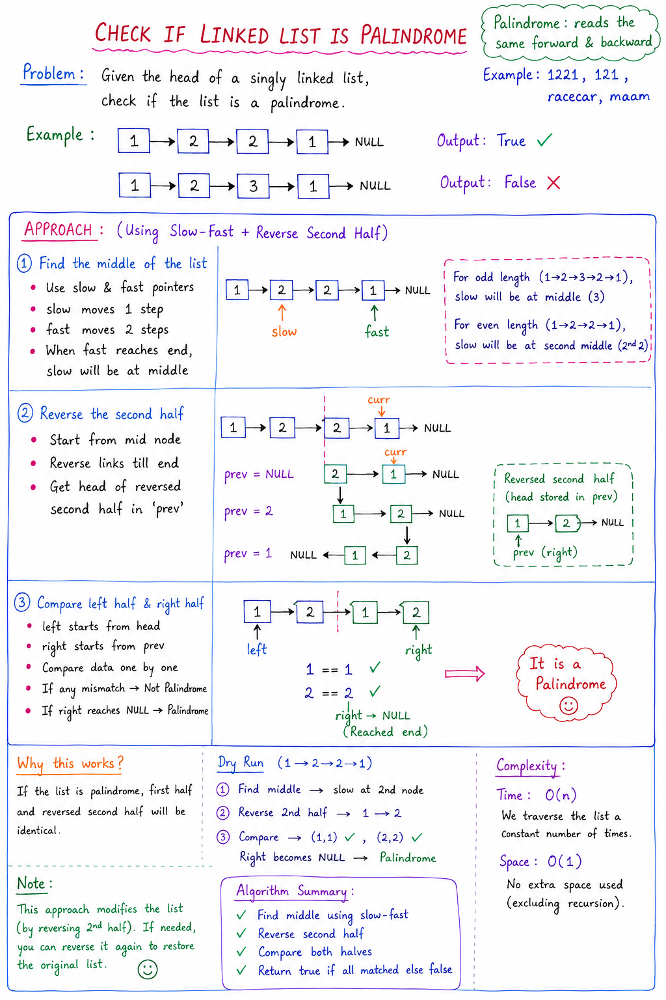

# Check if a Linked List is a Palindrome

## 📌 Problem Statement

Given the head of a singly linked list, check whether the linked list is a palindrome or not.

### Examples

| Input | Output |
|-------|--------|
| `1 -> 2 -> 2 -> 1` | `true` |
| `1 -> 2 -> 3 -> 2 -> 1` | `true` |
| `1 -> 2 -> 3 -> 4` | `false` |

---

## 📌 Idea / Approach

We use the **Slow & Fast Pointer + Reverse Second Half Technique**

### Steps:
1. Find the middle of the linked list
2. Reverse the second half of the linked list
3. Compare first half and second half
4. If all nodes match → Palindrome

---
# Note:


## 📌 Step 1: Find Middle (Slow & Fast Pointer)

### Logic:
- Slow moves 1 step
- Fast moves 2 steps
- When fast reaches end, slow is at middle

### Code:
```java
Node slow = head;
Node fast = head;

while (fast != null && fast.next != null) {
    slow = slow.next;
    fast = fast.next.next;
}
```

**Result:** `slow` points to the middle node

---

## 📌 Step 2: Reverse Second Half

### Logic:
Reverse the list starting from `mid`

```java
Node prev = null;
Node curr = slow;
Node next;

while (curr != null) {
    next = curr.next;
    curr.next = prev;
    prev = curr;
    curr = next;
}
```

**Result:** `prev` becomes the head of the reversed second half

---

## 📌 Step 3: Compare Both Halves

```java
Node left = head;
Node right = prev;

while (right != null) {
    if (left.data != right.data) {
        return false;
    }
    left = left.next;
    right = right.next;
}
return true;
```

---

## 📌 Complexity Analysis

| Type | Complexity | Reason |
|------|------------|--------|
| ⏱ Time | `O(n)` | Multiple passes, but all linear |
| 📦 Space | `O(1)` | No extra data structure used |

---

## 📌 Important Notes

- ✔ Works for both odd & even length lists
- ✔ Uses in-place reversal (efficient)
- ✔ Modifies original list (can be restored if needed)

---

## 📌 Why It Works

- First half remains the same
- Second half is reversed
- If palindrome → both halves become identical

---

## 📌 Edge Cases

| Case | Result |
|------|--------|
| Empty list | `true` |
| Single node | `true` |
| Two nodes | Check equality directly |