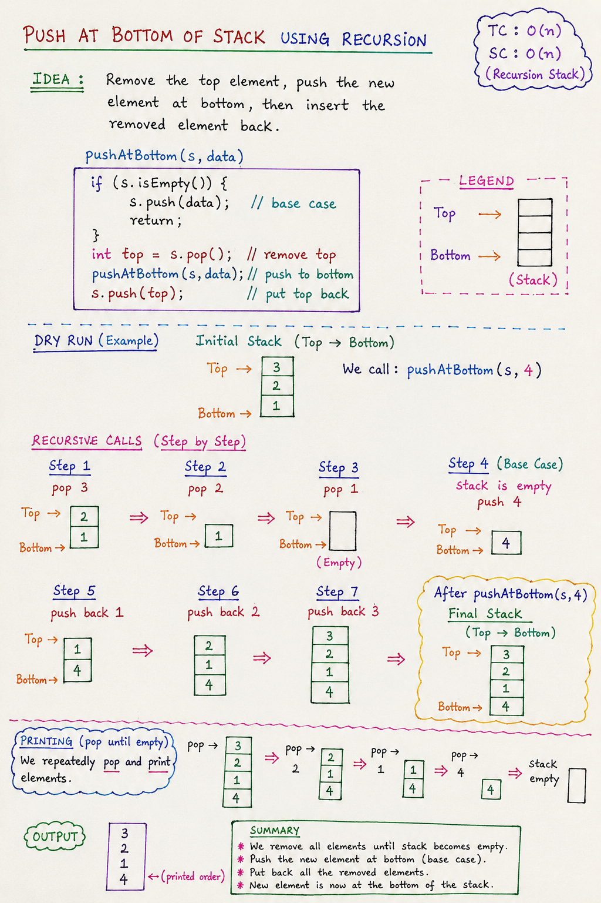

# Push at Bottom of Stack (Using Recursion)

## Overview

This problem demonstrates how to insert an element at the **bottom of a Stack** using **recursion**, without using any extra data structure.

Since a Stack follows **LIFO (Last In First Out)**, direct insertion at the bottom is not possible. So we temporarily remove all elements, insert the new element at the bottom, and then restore the original elements.

---
# Notes:


## Problem Statement

Given a Stack `s` and an element `data`, insert `data` at the **bottom of the stack**.

---

## Key Idea

We use recursion to:

1. Remove all elements from the stack.
2. Insert the new element when the stack becomes empty.
3. Push back all removed elements in the same order.

---

## Function Logic

~~~java
public static void pushAtBottom(Stack<Integer> s, int data) {
    if(s.isEmpty()) {
        s.push(data);
        return;
    }

    int top = s.pop();
    pushAtBottom(s, data);
    s.push(top);
}
~~~

---

## Step-by-Step Explanation

### Initial Stack

```text
Top
 ↓
3
2
1
```

### Goal

Insert `4` at the bottom:

```text
Top
 ↓
3
2
1
4
```

---

## Working of Recursion

### Step 1: Remove elements

We keep popping until stack becomes empty:

```text
pop → 3
pop → 2
pop → 1
```

Now stack is:

```text
(empty)
```

---

### Step 2: Base Case Triggered

When stack is empty:

~~~java
if(s.isEmpty()) {
    s.push(data);
    return;
}
~~~

We push `4`:

```text
4
```

---

### Step 3: Backtracking (Rebuilding Stack)

Now recursion returns and we push elements back:

```text
push(1)
push(2)
push(3)
```

Final Stack:

```text
Top
 ↓
3
2
1
4
```

---

## Dry Run Summary

| Step | Action | Stack State |
|------|--------|-------------|
| 1 | pop 3 | 2 → 1 |
| 2 | pop 2 | 1 |
| 3 | pop 1 | empty |
| 4 | push 4 | 4 |
| 5 | push 1 | 1 → 4 |
| 6 | push 2 | 2 → 1 → 4 |
| 7 | push 3 | 3 → 2 → 1 → 4 |

---

## Time Complexity

```
O(n)
```

### Reason:
- Each element is popped once
- Each element is pushed once

---

## Space Complexity

```
O(n)
```

### Reason:
- Recursion call stack stores n function calls

---

## Important Concepts Used

### 1. Recursion
Used to break problem into smaller subproblems.

### 2. Backtracking
After inserting at bottom, we restore the original stack order.

### 3. Stack Behavior (LIFO)
Last removed element is the first to be restored.

---

## Why This Works

We temporarily break the stack into:

- Bottom (empty state)
- Insert new element
- Restore previous elements in reverse order of removal

This preserves original order while inserting at bottom.

---

## Interview Importance

This is a **classic recursion + stack manipulation problem** used to test:

- Recursion understanding
- Stack operations
- Backtracking logic
- Problem-solving ability without extra space

---

## Common Mistake

❌ Trying to insert directly at bottom  
✔ Correct approach: remove → insert → restore

---

## Quick Revision

- Pop all elements recursively
- Insert when stack is empty
- Push elements back during recursion unwind
- Maintains original order
- Time: O(n), Space: O(n)

---

## One-Line Summary

**Push at Bottom of Stack uses recursion to temporarily empty the stack, insert the element at the base, and restore the stack using backtracking.**