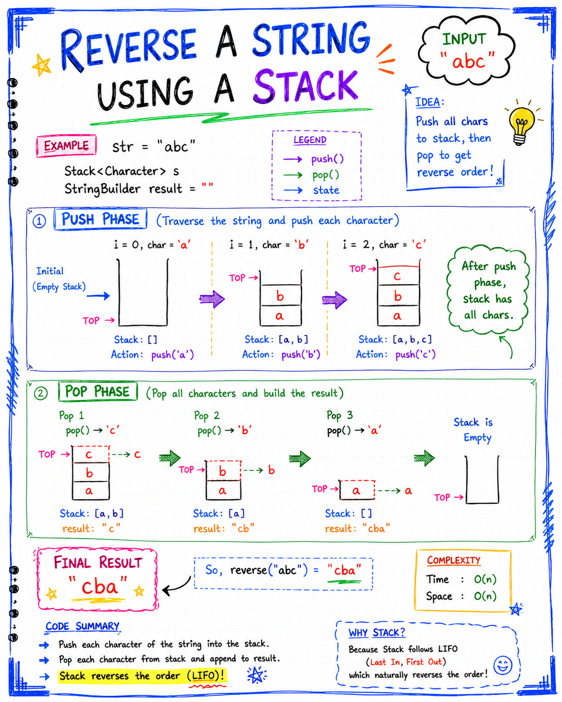

# Reverse a String using a Stack

## Overview

A Stack follows the **LIFO (Last In, First Out)** principle.

This property makes Stack a natural choice for reversing a string.

### Idea

1. Push all characters of the string into a Stack.
2. Pop all characters from the Stack.
3. Append popped characters to a new string.
4. The resulting string becomes the reverse of the original string.

---
# Notes:


## Problem Statement

Given a string:

```text
abc
```

Reverse it using a Stack.

Expected Output:

```text
cba
```

---

## Code

~~~java
public static String reverseString(String str) {

    Stack<Character> s = new Stack<>();
    int idx = 0;

    while(idx < str.length()) {
        s.push(str.charAt(idx));
        idx++;
    }

    StringBuilder result = new StringBuilder("");

    while(!s.isEmpty()) {
        char curr = s.pop();
        result.append(curr);
    }

    return result.toString();
}
~~~

---

## Why Stack Works

Stack follows:

```text
Last In → First Out
```

Example:

Input String:

```text
abc
```

Characters are inserted in this order:

```text
a
b
c
```

Stack:

```text
Top
 ↓
c
b
a
```

Since `c` was inserted last, it comes out first.

---

## Step-by-Step Dry Run

### Input

```text
abc
```

---

### Step 1: Push All Characters

Push `a`

```text
Top
 ↓
a
```

---

Push `b`

```text
Top
 ↓
b
a
```

---

Push `c`

```text
Top
 ↓
c
b
a
```

---

### Step 2: Pop All Characters

Pop:

```text
c
```

Result:

```text
c
```

---

Pop:

```text
b
```

Result:

```text
cb
```

---

Pop:

```text
a
```

Result:

```text
cba
```

---

### Final Output

```text
cba
```

---

## Visualization

### Original String

```text
a b c
```

### Stack After Push

```text
Top
 ↓
c
b
a
```

### Characters Removed

```text
c
↓
b
↓
a
```

### Reversed String

```text
cba
```

---

## Understanding StringBuilder

### Code

~~~java
StringBuilder result = new StringBuilder("");
~~~

Why not use:

~~~java
String result = "";
~~~

Because Strings are immutable in Java.

Every concatenation creates a new object:

~~~java
result = result + curr;
~~~

This is inefficient.

`StringBuilder` allows efficient appending:

~~~java
result.append(curr);
~~~

---

## Complexity Analysis

### Time Complexity

#### Push all characters

~~~java
s.push(...)
~~~

Takes:

```text
O(n)
```

---

#### Pop all characters

~~~java
s.pop()
~~~

Takes:

```text
O(n)
```

---

### Total Time Complexity

```text
O(n)
```

---

### Space Complexity

The stack stores all characters:

```text
O(n)
```

The StringBuilder also stores the reversed string:

```text
O(n)
```

Overall:

```text
O(n)
```

---

## Important Concepts Used

### 1. Stack

Stores characters in LIFO order.

---

### 2. Character Extraction

~~~java
str.charAt(idx)
~~~

Returns the character at index `idx`.

Example:

~~~java
"abc".charAt(1)
~~~

Returns:

```text
b
```

---

### 3. StringBuilder

Used for efficient string construction.

---

## Applications

The same idea is used in:

- Reversing words
- Undo operations
- Expression evaluation
- Palindrome checking
- Browser history
- Text editors

---

## Interview Point

Why is Stack useful for string reversal?

**Answer:**

Because Stack follows the LIFO principle. The last character inserted becomes the first character removed, automatically producing the reversed order.

---

## Quick Revision

- Push every character into Stack
- Stack stores characters in LIFO order
- Pop all characters
- Append popped characters to result
- Result becomes reversed string
- Time Complexity → O(n)
- Space Complexity → O(n)

---

## Example

Input:

```text
hello
```

Stack:

```text
Top
 ↓
o
l
l
e
h
```

Output:

```text
olleh
```

---

## One-Line Summary

**Reverse a String using a Stack by pushing all characters into the stack and popping them in LIFO order to build the reversed string.**