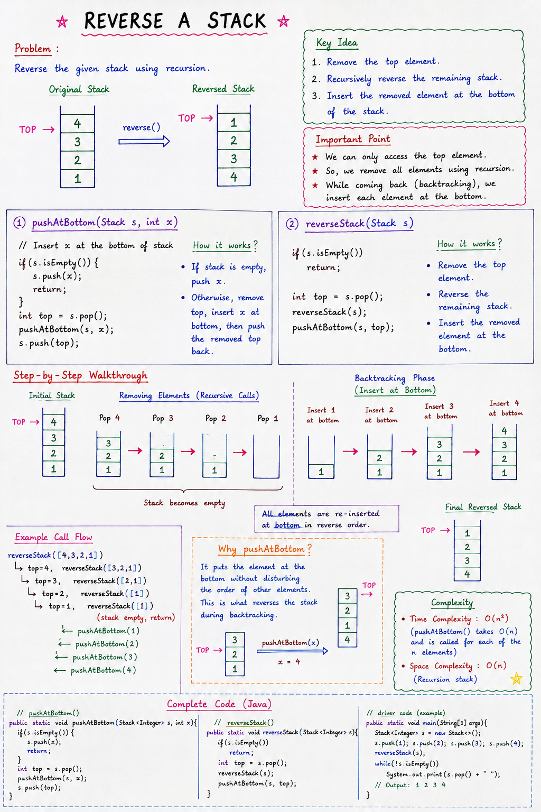

# Reverse a Stack (Using Recursion)

## Overview

The goal is to reverse the order of elements in a Stack using **recursion**.

Since Stack allows access only to the Top element, we cannot directly reverse it. Instead, we use recursion and the **Push at Bottom** technique.

---

# Notes: 


## Problem Statement

Given a Stack:

```text
Top
 ↓
3
2
1
```

Reverse it so that:

```text
Top
 ↓
1
2
3
```

---

## Key Idea

To reverse a stack:

1. Remove the top element.
2. Recursively reverse the remaining stack.
3. Insert the removed element at the bottom.

This process continues until the stack becomes empty.

---

## Helper Function: pushAtBottom()

Before reversing a stack, we need a function that inserts an element at the bottom.

### Code

~~~java
public static void pushAtBottom(Stack<Integer> s, int data) {

    if(s.isEmpty()) {
        s.push(data);
        return;
    }

    int top = s.pop();

    pushAtBottom(s, data);

    s.push(top);
}
~~~

### Purpose

Inserts an element at the bottom while preserving the order of existing elements.

---

## Reverse Stack Function

### Code

~~~java
public static void reverseStack(Stack<Integer> s) {

    if(s.isEmpty()) {
        return;
    }

    int top = s.pop();

    reverseStack(s);

    pushAtBottom(s, top);
}
~~~

---

## How the Algorithm Works

### Initial Stack

```text
Top
 ↓
3
2
1
```

---

### Step 1: Remove Top Element

Pop:

```text
3
```

Remaining Stack:

```text
Top
 ↓
2
1
```

Store:

~~~java
top = 3
~~~

---

### Step 2: Recursive Call

Again pop:

```text
2
```

Remaining Stack:

```text
Top
 ↓
1
```

Store:

~~~java
top = 2
~~~

---

### Step 3: Recursive Call

Again pop:

```text
1
```

Remaining Stack:

```text
(empty)
```

Store:

~~~java
top = 1
~~~

---

### Step 4: Base Case

Stack becomes empty:

~~~java
if(s.isEmpty()) {
    return;
}
~~~

Recursion starts returning.

---

## Backtracking Phase

### Insert 1 at Bottom

~~~java
pushAtBottom(s, 1);
~~~

Stack:

```text
1
```

---

### Insert 2 at Bottom

~~~java
pushAtBottom(s, 2);
~~~

Stack:

```text
Top
 ↓
1
2
```

---

### Insert 3 at Bottom

~~~java
pushAtBottom(s, 3);
~~~

Stack:

```text
Top
 ↓
1
2
3
```

Stack is now reversed.

---

## Complete Dry Run

### Original Stack

```text
Top
 ↓
3
2
1
```

---

### Elements Removed

```text
3
2
1
```

Stack becomes:

```text
(empty)
```

---

### Elements Reinserted at Bottom

```text
1
↓
2
↓
3
```

---

### Final Stack

```text
Top
 ↓
1
2
3
```

---

## Visualization

### Recursive Removal

```text
3 → removed
2 → removed
1 → removed
```

Stack:

```text
(empty)
```

---

### Backtracking

```text
Insert 1 at bottom
Insert 2 at bottom
Insert 3 at bottom
```

Result:

```text
Top
 ↓
1
2
3
```

---

## Why It Works

The recursion removes all elements and stores them in the function call stack.

During backtracking:

- First removed element is inserted last.
- Last removed element is inserted first.

This naturally reverses the Stack.

---

## Complexity Analysis

### reverseStack()

Called for every element:

```text
n calls
```

---

### pushAtBottom()

For each recursive call:

```text
O(n)
```

in the worst case.

---

### Total Time Complexity

```text
O(n) + O(n-1) + O(n-2) + ... + O(1)
```

```text
O(n²)
```

---

### Space Complexity

Recursion call stack stores all elements:

```text
O(n)
```

---

## Important Concepts Used

### 1. Recursion

Breaks the problem into smaller subproblems.

---

### 2. Backtracking

Rebuilds the Stack while returning from recursive calls.

---

### 3. Push at Bottom

Used to place removed elements in reverse order.

---

## Applications

This concept helps understand:

- Recursion on data structures
- Backtracking
- Stack manipulation
- Recursive problem solving

---

## Interview Point

How do we reverse a stack without using another stack?

**Answer:**

Use recursion to remove all elements and then insert each removed element at the bottom during backtracking.

---

## Common Mistakes

### ❌ Incorrect Complexity

Many students write:

```text
O(n)
```

This is wrong.

Because:

- `reverseStack()` makes `n` recursive calls.
- Each call uses `pushAtBottom()`, which may take `O(n)`.

Correct complexity:

```text
O(n²)
```

---

## Quick Revision

- Pop top element
- Reverse remaining stack recursively
- Insert removed element at bottom
- Continue until stack becomes empty
- Uses recursion + backtracking
- Time Complexity → O(n²)
- Space Complexity → O(n)

---

## Example

Initial Stack:

```text
Top
 ↓
5
4
3
2
1
```

After reversal:

```text
Top
 ↓
1
2
3
4
5
```

---

## One-Line Summary

**Reverse a Stack using recursion by removing all elements and reinserting them at the bottom during backtracking, which reverses the stack order.**