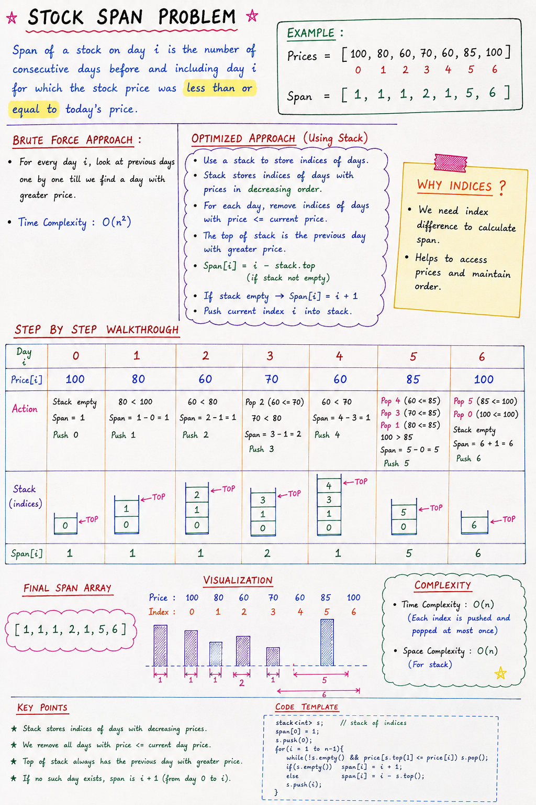

# Stock Span Problem

## Overview

The **Stock Span Problem** is a classic Stack problem.

For each day, we need to find:

> The number of consecutive previous days (including the current day) for which the stock price was less than or equal to the current day's price.

Instead of checking all previous days repeatedly, we use a **Stack** to achieve an efficient solution.

---
# Notes: 

Note: there is mistake in visualization diagram

## Problem Statement

Given stock prices:

```text
[100, 80, 60, 70, 60, 85, 100]
```

Find the span for each day.

---

## Expected Output

```text
[1, 1, 1, 2, 1, 5, 6]
```

---

## What is Span?

Span of a stock on day `i` is:

> Number of consecutive days before and including day `i` where stock price is less than or equal to today's price.

---

## Example

### Day 0

Price:

```text
100
```

No previous day exists.

Span:

```text
1
```

---

### Day 1

Price:

```text
80
```

Previous day:

```text
100
```

100 is greater than 80.

Span:

```text
1
```

---

### Day 3

Price:

```text
70
```

Previous prices:

```text
60
```

60 ≤ 70

Continue checking:

```text
80
```

80 > 70

Stop.

Span:

```text
2
```

(Current day + one previous day)

---

### Day 5

Price:

```text
85
```

Previous prices:

```text
60 ≤ 85
70 ≤ 85
60 ≤ 85
80 ≤ 85
100 > 85
```

Stop at 100.

Span:

```text
5
```

---

## Brute Force Approach

For every day:

1. Move left.
2. Count consecutive smaller or equal prices.
3. Stop when a larger price is found.

### Complexity

```text
O(n²)
```

Because for each day we may traverse all previous days.

---

## Optimized Approach Using Stack

### Key Idea

Instead of storing prices, we store **indices** of stock prices.

```java
Stack<Integer> s
```

Stores:

```text
0, 1, 2, 3, ...
```

Not:

```text
100, 80, 60, ...
```

---

## Why Store Indices?

Suppose stack contains:

```text
Top
 ↓
4
3
1
0
```

We can access prices using:

~~~java
stocks[s.peek()]
~~~

This allows us to:

- Compare prices
- Calculate span using index differences

---

## Algorithm

For each day:

### Step 1

Remove all smaller prices from stack.

~~~java
while(!s.isEmpty() &&
      currPrice > stocks[s.peek()]) {
    s.pop();
}
~~~

---

### Step 2

If stack becomes empty:

~~~java
span[i] = i + 1;
~~~

Meaning:

Current price is greater than all previous prices.

---

### Step 3

Otherwise:

~~~java
int prevHigh = s.peek();
span[i] = i - prevHigh;
~~~

Here:

`prevHigh` = nearest previous day having greater price.

---

### Step 4

Push current index into stack.

~~~java
s.push(i);
~~~

---

## Code

~~~java
public static void stockSpan(int stocks[], int span[]) {

    Stack<Integer> s = new Stack<>();

    span[0] = 1;
    s.push(0);

    for(int i = 1; i < stocks.length; i++) {

        int currPrice = stocks[i];

        while(!s.isEmpty() &&
              currPrice > stocks[s.peek()]) {
            s.pop();
        }

        if(s.isEmpty()) {
            span[i] = i + 1;
        } else {
            int prevHigh = s.peek();
            span[i] = i - prevHigh;
        }

        s.push(i);
    }
}
~~~

---

## Dry Run

### Input

```text
Index : 0   1   2   3   4   5    6
Price :100 80 60 70 60 85 100
```

---

### Day 0

Price = 100

Span:

```text
1
```

Stack:

```text
[0]
```

---

### Day 1

Price = 80

100 > 80

Span:

```text
1
```

Stack:

```text
[0,1]
```

---

### Day 2

Price = 60

80 > 60

Span:

```text
1
```

Stack:

```text
[0,1,2]
```

---

### Day 3

Price = 70

70 > 60

Pop index 2.

Nearest greater:

```text
80
```

Span:

```text
3 - 1 = 2
```

Stack:

```text
[0,1,3]
```

---

### Day 4

Price = 60

Nearest greater:

```text
70
```

Span:

```text
1
```

Stack:

```text
[0,1,3,4]
```

---

### Day 5

Price = 85

Pop:

```text
60
70
80
```

Nearest greater:

```text
100
```

Span:

```text
5 - 0 = 5
```

Stack:

```text
[0,5]
```

---

### Day 6

Price = 100

Pop:

```text
85
```

Nearest greater:

```text
100
```

Span:

```text
6
```

Stack:

```text
[0,6]
```

---

### Final Span Array

```text
[1, 1, 1, 2, 1, 5, 6]
```

---

## Visualization

### Prices

```text
100  80  60  70  60  85  100
```

### Span

```text
 1    1   1   2   1   5    6
```

---

## Why Stack Makes It Efficient

Without Stack:

```text
For every day
    check all previous days
```

Time:

```text
O(n²)
```

---

With Stack:

Each index is:

- Pushed once
- Popped once

Therefore:

```text
O(n)
```

---

## Complexity Analysis

### Time Complexity

```text
O(n)
```

Each index enters and leaves the stack at most one time.

---

### Space Complexity

```text
O(n)
```

For storing indices in the stack.

---

## Important Concepts Used

### 1. Stack

Stores indices of useful previous days.

---

### 2. Previous Greater Element

We are effectively finding:

> Nearest previous day having a greater stock price.

---

### 3. Monotonic Stack

The stack maintains indices of stock prices in decreasing order.

---

## Interview Point

Why do we store indices instead of stock prices?

**Answer:**

Because span is calculated using positions:

~~~java
span[i] = i - prevHigh;
~~~

To compute this difference, we need indices, not values.

---

## Quick Revision

- Store indices in stack
- Remove smaller prices
- Top of stack gives nearest greater price
- If stack empty → span = i + 1
- Otherwise → span = i - previous greater index
- Each index pushed and popped once
- Time Complexity = O(n)
- Space Complexity = O(n)

---

## One-Line Summary

**The Stock Span Problem uses a Monotonic Stack of indices to efficiently find the nearest previous greater stock price and compute spans in O(n) time.**