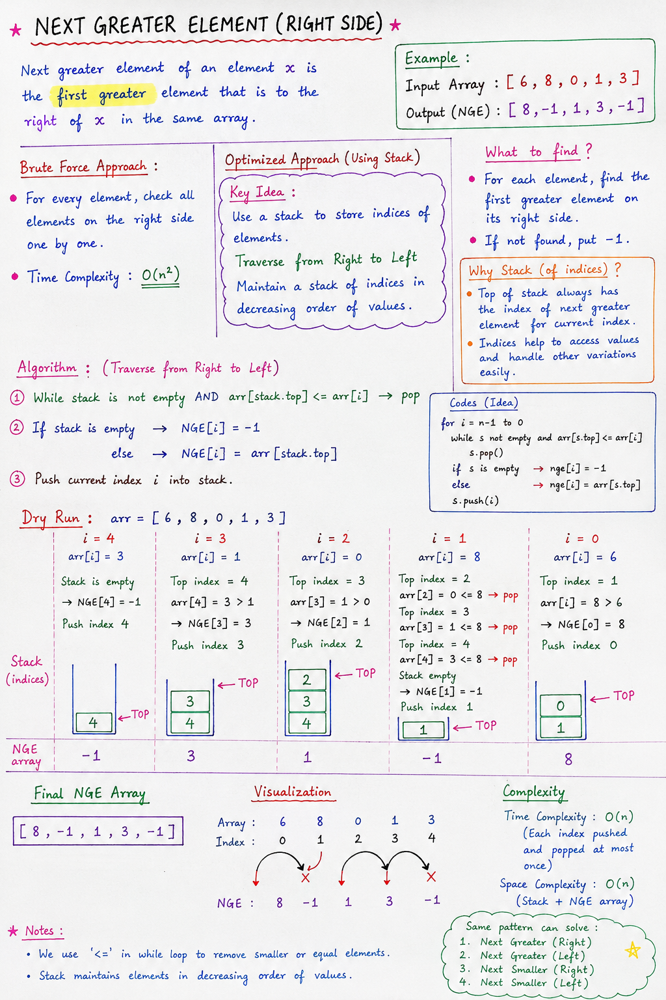

# Next Greater Element (Right Side)

## Overview

The **Next Greater Element (NGE)** of an element is the first element to its right that is greater than it.

If no greater element exists on the right side, the answer is:

```text
-1
```

This problem is efficiently solved using a **Monotonic Stack**.

---

## Problem Statement

Given:

```text
arr = [6, 8, 0, 1, 3]
```

Find the next greater element for every index.

---

## Expected Output

```text
[8, -1, 1, 3, -1]
```

---

## Understanding the Problem

### Element = 6

Right side:

```text
8, 0, 1, 3
```

First greater element:

```text
8
```

Answer:

```text
8
```

---

### Element = 8

Right side:

```text
0, 1, 3
```

No greater element exists.

Answer:

```text
-1
```

---

### Element = 0

Right side:

```text
1, 3
```

First greater element:

```text
1
```

Answer:

```text
1
```

---

### Element = 1

Right side:

```text
3
```

First greater element:

```text
3
```

Answer:

```text
3
```

---

### Element = 3

No elements on the right.

Answer:

```text
-1
```

---

### Final Output

```text
[8, -1, 1, 3, -1]
```

---

## Brute Force Approach

For every element:

1. Move to the right.
2. Find first greater element.
3. Store answer.

### Complexity

```text
O(n²)
```

Because each element may scan the entire remaining array.

---

## Optimized Approach Using Stack

### Key Idea

Traverse from:

```text
Right → Left
```

Because we need information about elements on the right side.

---

## What Does the Stack Store?

The stack stores:

```text
Indices
```

Not values.

Example:

```text
Stack
 ↓
4
3
1
```

To access actual values:

~~~java
arr[s.peek()]
~~~

---

## Why Store Indices?

Storing indices helps:

- Access values
- Solve other variations easily
- Maintain consistency with Stack problems

---

## Algorithm

For each element from right to left:

### Step 1

Remove all smaller or equal elements.

~~~java
while(!s.isEmpty() &&
      arr[s.peek()] <= arr[i]) {
    s.pop();
}
~~~

Why?

Because those elements can never become the next greater element.

---

### Step 2

Find answer.

If stack becomes empty:

~~~java
nextGreater[i] = -1;
~~~

No greater element exists.

Otherwise:

~~~java
nextGreater[i] = arr[s.peek()];
~~~

Top of stack contains the next greater element.

---

### Step 3

Push current index.

~~~java
s.push(i);
~~~

---

# notes: 

Note: there is mistake in visualization diagram

## Code

~~~java
Stack<Integer> s = new Stack<>();
int nextGreater[] = new int[arr.length];

for(int i = arr.length - 1; i >= 0; i--) {

    while(!s.isEmpty() &&
          arr[s.peek()] <= arr[i]) {
        s.pop();
    }

    if(s.isEmpty()) {
        nextGreater[i] = -1;
    } else {
        nextGreater[i] = arr[s.peek()];
    }

    s.push(i);
}
~~~

---

## Dry Run

### Input

```text
Index : 0  1  2  3  4
Value : 6  8  0  1  3
```

---

### i = 4 (Value = 3)

Stack empty.

Answer:

```text
-1
```

Push index 4.

Stack:

```text
[4]
```

---

### i = 3 (Value = 1)

Top:

```text
3
```

3 > 1

Answer:

```text
3
```

Push index 3.

Stack:

```text
[4,3]
```

---

### i = 2 (Value = 0)

Top:

```text
1
```

1 > 0

Answer:

```text
1
```

Push index 2.

Stack:

```text
[4,3,2]
```

---

### i = 1 (Value = 8)

Remove all smaller elements:

```text
0
1
3
```

Stack becomes empty.

Answer:

```text
-1
```

Push index 1.

Stack:

```text
[1]
```

---

### i = 0 (Value = 6)

Top:

```text
8
```

8 > 6

Answer:

```text
8
```

Push index 0.

Stack:

```text
[1,0]
```

---

### Final Answer

```text
[8, -1, 1, 3, -1]
```

---

## Visualization

### Array

```text
6   8   0   1   3
```

### Next Greater

```text
8  -1   1   3  -1
```

---

## Why We Use <=

Condition:

~~~java
arr[s.peek()] <= arr[i]
~~~

Suppose:

```text
[5, 5]
```

For the first `5`:

Second `5` is not greater.

Therefore it must be removed.

Using:

~~~java
<=
~~~

ensures only strictly greater elements remain in the stack.

---

## Monotonic Stack Concept

After processing:

The stack maintains elements in decreasing order.

Example:

```text
Top
 ↓
1
3
8
```

This is called a **Monotonic Decreasing Stack**.

---

## Complexity Analysis

### Time Complexity

```text
O(n)
```

Reason:

Each index:

- Pushed once
- Popped once

Total operations ≤ 2n.

---

### Space Complexity

```text
O(n)
```

For storing indices in the stack.

---

## Common Variations

The same pattern solves:

### 1. Next Greater Element (Right)

```text
Current Problem
```

---

### 2. Next Greater Element (Left)

Traverse:

```text
Left → Right
```

---

### 3. Next Smaller Element (Right)

Change comparison:

~~~java
arr[s.peek()] >= arr[i]
~~~

---

### 4. Next Smaller Element (Left)

Traverse left to right and use:

~~~java
arr[s.peek()] >= arr[i]
~~~

---

## Interview Point

Why do we traverse from right to left?

**Answer:**

Because we need information about elements that lie on the right side of the current element. Processing from right to left ensures those elements have already been handled.

---

## Quick Revision

- Traverse from right to left
- Stack stores indices
- Remove smaller or equal elements
- Top of stack becomes next greater element
- If stack empty → answer = -1
- Push current index
- Time Complexity = O(n)
- Space Complexity = O(n)

---

## Example

Input:

```text
[4, 5, 2, 25]
```

Output:

```text
[5, 25, 25, -1]
```

---

## One-Line Summary

**Next Greater Element (Right Side) uses a Monotonic Stack to find the first greater element on the right of every array element in O(n) time.**