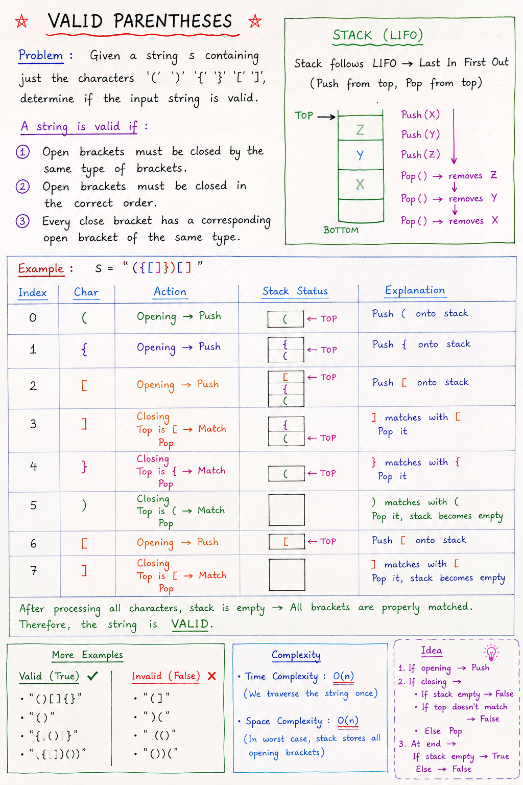

# Valid Parentheses

## Problem Statement

Given a string `s` containing only the following characters:

```text
( ) { } [ ]
```

Determine whether the string is **valid**.

A string is valid if:

1. Every opening bracket has a corresponding closing bracket of the same type.
2. Brackets are closed in the correct order.
3. No closing bracket appears before its matching opening bracket.

---

## Examples

### Valid Cases

```text
s = "()"
Output = true
```

```text
s = "()[]{}"
Output = true
```

```text
s = "{[()]}"
Output = true
```

```text
s = "({[]}())"
Output = true
```

### Invalid Cases

```text
s = "(]"
Output = false
```

```text
s = ")("
Output = false
```

```text
s = "((("
Output = false
```

```text
s = "([)]"
Output = false
```

---

# Notes:


# Approach

## Why Use Stack?

A Stack follows the **LIFO (Last In First Out)** principle.

When we encounter an opening bracket:

```text
(
{
[
```

we push it into the stack.

When we encounter a closing bracket:

```text
)
}
]
```

we check whether the top element of the stack contains the matching opening bracket.

If it matches:

```text
Pop from stack
```

Otherwise:

```text
Return false
```

---

# Algorithm

1. Create an empty stack.
2. Traverse each character of the string.
3. If the character is an opening bracket:

   - Push it into the stack.

4. Otherwise, it is a closing bracket:

   - If stack is empty → return false.
   - Check whether stack top forms a valid pair.
   - If yes → pop the opening bracket.
   - If no → return false.

5. After traversal:

   - If stack becomes empty → return true.
   - Otherwise → return false.

---

# Dry Run

## Example

```text
s = "({})[]"
```

### Step 1

Character:

```text
(
```

Push into stack.

```text
Stack:
(
```

---

### Step 2

Character:

```text
{
```

Push into stack.

```text
Stack:
{
(
```

---

### Step 3

Character:

```text
}
```

Top of stack:

```text
{
```

Valid pair:

```text
{}
```

Pop.

```text
Stack:
(
```

---

### Step 4

Character:

```text
)
```

Top of stack:

```text
(
```

Valid pair:

```text
()
```

Pop.

```text
Stack:
Empty
```

---

### Step 5

Character:

```text
[
```

Push.

```text
Stack:
[
```

---

### Step 6

Character:

```text
]
```

Top:

```text
[
```

Valid pair:

```text
[]
```

Pop.

```text
Stack:
Empty
```

---

Traversal completed.

Stack is empty.

```text
Return true
```

---

# Code

```java
import java.util.Stack;

public class Stacks {

    public static boolean isValid(String str) {
        Stack<Character> s = new Stack<>();

        for (int i = 0; i < str.length(); i++) {
            char ch = str.charAt(i);

            // Opening bracket
            if (ch == '(' || ch == '{' || ch == '[') {
                s.push(ch);
            }

            // Closing bracket
            else {

                // No opening bracket available
                if (s.isEmpty()) {
                    return false;
                }

                // Matching pair found
                if ((s.peek() == '(' && ch == ')')
                        || (s.peek() == '{' && ch == '}')
                        || (s.peek() == '[' && ch == ']')) {

                    s.pop();
                }

                // Invalid pair
                else {
                    return false;
                }
            }
        }

        return s.isEmpty();
    }

    public static void main(String[] args) {
        String str = "({})[]";
        System.out.println(isValid(str));
    }
}
```

---

# Important Edge Cases

## Case 1

```text
s = "))))"
```

No opening bracket exists.

```text
Output = false
```

---

## Case 2

```text
s = "((("
```

Opening brackets remain unmatched.

```text
Output = false
```

---

## Case 3

```text
s = "([)]"
```

Order is incorrect.

Expected:

```text
([])
```

Actual:

```text
([)]
```

```text
Output = false
```

---

## Case 4

```text
s = ""
```

Empty string contains no invalid brackets.

```text
Output = true
```

---

# Time Complexity

Each character is processed exactly once.

```text
Time Complexity = O(n)
```

where `n` is the length of the string.

---

# Space Complexity

In the worst case all opening brackets are stored in the stack.

Example:

```text
"((((((("
```

Stack size becomes `n`.

```text
Space Complexity = O(n)
```

---

# Key Idea

```text
Opening Bracket  -> Push
Matching Pair    -> Pop
Invalid Pair     -> Return false
End of String    -> Stack must be empty
```

If the stack is empty after processing the entire string, every bracket found its correct matching pair.