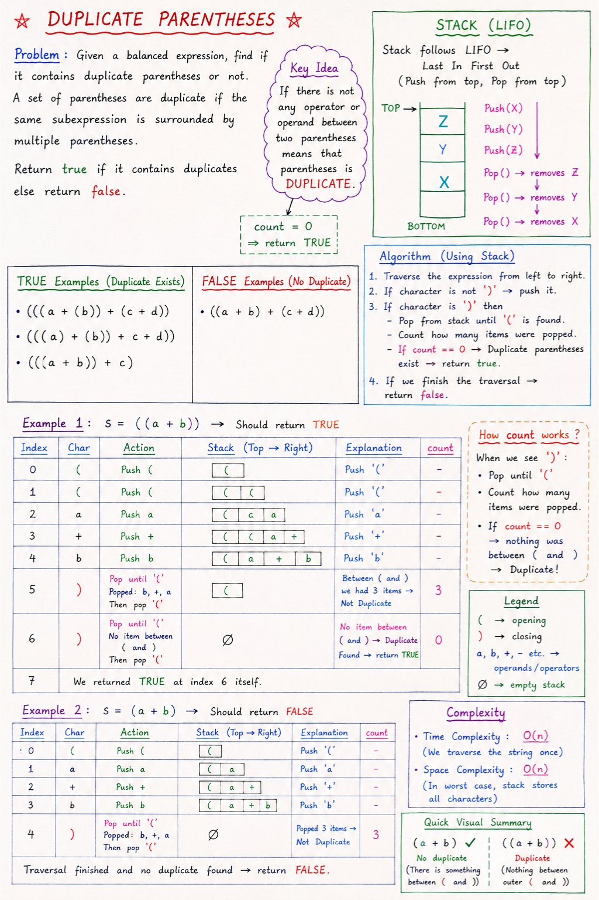

# Duplicate Parentheses

## Problem Statement

Given a **balanced expression**, determine whether it contains **duplicate (unnecessary) parentheses**.

A set of parentheses is considered duplicate if the same subexpression is surrounded by multiple parentheses unnecessarily.

Return:

```text
true  -> Duplicate parentheses exist
false -> No duplicate parentheses
```

---

# Note:


# Examples

## Duplicate Parentheses Present

### Example 1

```text
(((a + (b))) + (c + d))
```

Output:

```text
true
```

Reason:

```text
(b)
```

contains only a single operand and is unnecessarily wrapped.

---

### Example 2

```text
((((a) + (b)) + c + d))
```

Output:

```text
true
```

Reason:

```text
(a)
(b)
```

contain unnecessary parentheses.

---

### Example 3

```text
((a + b) + c)
```

Output:

```text
false
```

---

### Example 4

```text
((a + b))
```

Output:

```text
true
```

Reason:

```text
(a + b)
```

is already grouped once.

The outer parentheses create:

```text
((a + b))
```

which introduces an unnecessary extra pair.

---


# Key Idea

Whenever we encounter a closing parenthesis:

```text
)
```

we check how many characters exist between:

```text
(
and
)
```

If no character exists between them:

```text
()
```

then the parentheses are useless.

Therefore:

```text
Duplicate Parentheses Found
```

---

# Why Stack?

A Stack follows:

```text
LIFO (Last In First Out)
```

When traversing the expression:

- Push every character into the stack.
- When a closing bracket `)` is found:
  - Remove everything until `(` is encountered.
  - Count how many characters were removed.

If:

```text
count == 0
```

then:

```text
()
```

exists.

Hence duplicate parentheses are present.

---

# Algorithm

1. Create an empty stack.
2. Traverse the expression character by character.
3. If character is not `)`:

   - Push it into the stack.

4. If character is `)`:

   - Initialize count = 0.
   - Pop elements until `(` is found.
   - Increase count for every popped character.
   - Remove the opening bracket `(`.

5. If:

   ```text
   count == 0
   ```

   return:

   ```text
   true
   ```

6. After complete traversal:

   ```text
   return false
   ```

---

# Dry Run

## Example

```text
((a+b))
```

---

### Step 1

Read:

```text
(
```

Push.

```text
Stack:
(
```

---

### Step 2

Read:

```text
(
```

Push.

```text
Stack:
(
(
```

---

### Step 3

Read:

```text
a
```

Push.

```text
Stack:
a
(
(
```

---

### Step 4

Read:

```text
+
```

Push.

```text
Stack:
+
a
(
(
```

---

### Step 5

Read:

```text
b
```

Push.

```text
Stack:
b
+
a
(
(
```

---

### Step 6

Read:

```text
)
```

Pop until `(`.

```text
Pop b
Pop +
Pop a
```

Count:

```text
count = 3
```

Remove opening bracket:

```text
(
```

Stack:

```text
(
```

Since:

```text
count > 0
```

No duplicate found.

---

### Step 7

Read:

```text
)
```

Immediately encounter:

```text
(
```

Count:

```text
count = 0
```

Meaning:

```text
()
```

exists.

Therefore:

```text
Return true
```

---

# Visualization

## Valid Expression

```text
((a+b)+(c+d))
```

Inside every pair:

```text
(a+b)
(c+d)
```

contains meaningful content.

Result:

```text
false
```

---

## Duplicate Parentheses

```text
((a+b))
```

Structure:

```text
(
   (a+b)
)
```

Outer parentheses contain only one grouped expression.

Result:

```text
true
```

---

# Code

```java
import java.util.Stack;

public class Stacks {

    public static boolean isDuplicate(String str) {
        Stack<Character> s = new Stack<>();

        for (int i = 0; i < str.length(); i++) {
            char ch = str.charAt(i);

            // Closing bracket
            if (ch == ')') {

                int count = 0;

                while (s.pop() != '(') {
                    count++;
                }

                // Duplicate parentheses found
                if (count == 0) {
                    return true;
                }
            }

            // Opening bracket, operand, operator
            else {
                s.push(ch);
            }
        }

        return false;
    }

    public static void main(String[] args) {
        String str = "((a+b))";
        System.out.println(isDuplicate(str));
    }
}
```

---

# Time Complexity

Each character is:

- Pushed at most once
- Popped at most once

Therefore:

```text
Time Complexity = O(n)
```

where:

```text
n = length of expression
```

---

# Space Complexity

In the worst case every character is stored inside the stack.

Example:

```text
((((a+b+c+d))))
```

Therefore:

```text
Space Complexity = O(n)
```

---

# Important Edge Cases

## Case 1

```text
()
```

Output:

```text
true
```

Reason:

```text
No character exists between parentheses.
```

---

## Case 2

```text
(a+b)
```

Output:

```text
false
```

Reason:

```text
Contains useful expression.
```

---

## Case 3

```text
((a+b))
```

Output:

```text
true
```

Reason:

```text
Extra outer parentheses.
```

---

## Case 4

```text
((a+b)+(c+d))
```

Output:

```text
false
```

Reason:

```text
Every pair contributes to grouping.
```

---

# Key Observation

```text
When ')' is encountered:

Pop until '('

count = number of characters removed

count > 0  -> Useful parentheses

count = 0  -> Duplicate parentheses
```

This simple observation allows us to detect unnecessary parentheses efficiently using a Stack.