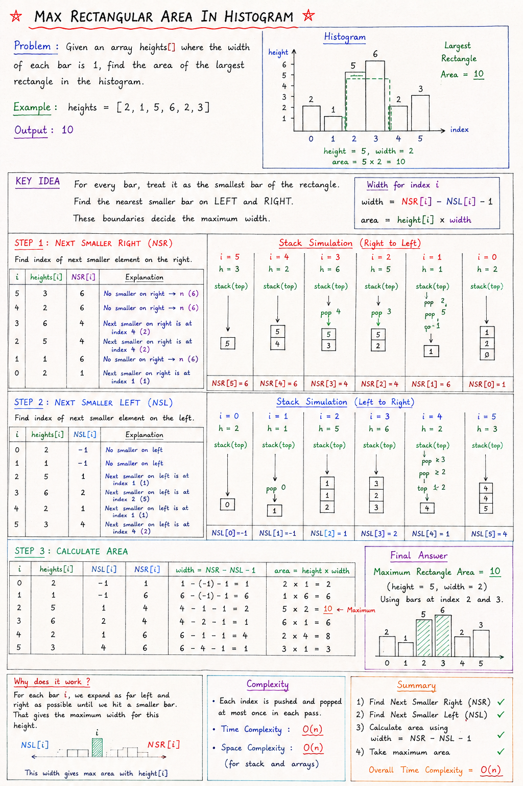

# Maximum Rectangular Area in Histogram

## Problem Statement

Given an array `heights[]` representing the heights of bars in a histogram, where the width of every bar is `1`, find the area of the largest rectangle that can be formed.

# Note:


### Example

```text
Input:
heights = [2, 1, 5, 6, 2, 3]

Output:
10
```

Visualization:

```text
Height

6 |         █
5 |       █ █
4 |       █ █
3 |       █ █     █
2 | █     █ █ █   █
1 | █ █   █ █ █ █ █
    -----------------
    2 1 5 6 2 3
```

The largest rectangle has:

```text
Height = 5
Width  = 2

Area = 5 × 2 = 10
```

---

# Key Idea

For every bar:

```text
Area = Height × Width
```

Height is already known:

```text
height = arr[i]
```

The challenge is finding the maximum width for which this height can extend.

To find the width, we need:

```text
1. Next Smaller Element on Left (NSL)
2. Next Smaller Element on Right (NSR)
```

---

# Why NSL and NSR?

Consider:

```text
Index : 0 1 2 3 4 5
Value : 2 1 5 6 2 3
```

For bar:

```text
height = 5
index = 2
```

We find:

```text
NSL = 1
NSR = 4
```

Visualization:

```text
2   1   5   6   2   3
    ↑       ↑
   NSL     NSR
```

Since height 5 can extend until a smaller element appears:

```text
Width = NSR - NSL - 1
      = 4 - 1 - 1
      = 2
```

Therefore:

```text
Area = 5 × 2
     = 10
```

---

# Formula

For every index `i`:

```text
Height = arr[i]

Width = NSR[i] - NSL[i] - 1

Area = Height × Width
```

Maximum of all areas is the answer.

---

# Approach

The solution is divided into three steps:

```text
Step 1 -> Find Next Smaller Right (NSR)
Step 2 -> Find Next Smaller Left (NSL)
Step 3 -> Calculate Area for each bar
```

---

# Step 1 : Next Smaller Right (NSR)

For every element, find the index of the first smaller element on its right.

Example:

```text
Array:

2 1 5 6 2 3
```

NSR:

```text
Index : 0 1 2 3 4 5
Value : 2 1 5 6 2 3

NSR   : 1 6 4 4 6 6
```

Explanation:

```text
For 2 → next smaller is 1 at index 1

For 1 → no smaller element exists
         so NSR = n = 6

For 5 → next smaller is 2 at index 4

For 6 → next smaller is 2 at index 4
```

---

# Step 2 : Next Smaller Left (NSL)

For every element, find the first smaller element on its left.

NSL:

```text
Index : 0 1 2 3 4 5
Value : 2 1 5 6 2 3

NSL   : -1 -1 1 2 1 4
```

Explanation:

```text
For 2 → no smaller on left
         NSL = -1

For 5 → smaller is 1 at index 1

For 6 → smaller is 5 at index 2
```

---

# Step 3 : Calculate Area

Formula:

```text
Width = NSR - NSL - 1

Area = Height × Width
```

---

# Dry Run

## Histogram

```text
Index : 0 1 2 3 4 5
Value : 2 1 5 6 2 3
```

---

### Bar at Index 0

```text
Height = 2

NSL = -1
NSR = 1

Width = 1 - (-1) - 1
      = 1

Area = 2 × 1
     = 2
```

---

### Bar at Index 1

```text
Height = 1

NSL = -1
NSR = 6

Width = 6 - (-1) - 1
      = 6

Area = 1 × 6
     = 6
```

---

### Bar at Index 2

```text
Height = 5

NSL = 1
NSR = 4

Width = 4 - 1 - 1
      = 2

Area = 5 × 2
     = 10
```

---

### Bar at Index 3

```text
Height = 6

NSL = 2
NSR = 4

Width = 4 - 2 - 1
      = 1

Area = 6 × 1
     = 6
```

---

### Bar at Index 4

```text
Height = 2

NSL = 1
NSR = 6

Width = 6 - 1 - 1
      = 4

Area = 2 × 4
     = 8
```

---

### Bar at Index 5

```text
Height = 3

NSL = 4
NSR = 6

Width = 6 - 4 - 1
      = 1

Area = 3 × 1
     = 3
```

---

Maximum Area:

```text
max(2, 6, 10, 6, 8, 3)

= 10
```

Answer:

```text
10
```

---

# Why Width = NSR - NSL - 1 ?

Suppose:

```text
NSL = 1
NSR = 4
```

Visualization:

```text
0 1 2 3 4 5
  L █ █ R
```

The rectangle can occupy:

```text
Index 2
Index 3
```

Number of bars:

```text
4 - 1 - 1
= 2
```

Therefore:

```text
Width = NSR - NSL - 1
```

---

# Code

```java
import java.util.Stack;

public class Stacks {

    public static void maxArea(int arr[]) {

        int maxArea = 0;

        int nsr[] = new int[arr.length];
        int nsl[] = new int[arr.length];

        // Next Smaller Right
        Stack<Integer> s = new Stack<>();

        for (int i = arr.length - 1; i >= 0; i--) {

            while (!s.isEmpty() &&
                   arr[s.peek()] >= arr[i]) {
                s.pop();
            }

            if (s.isEmpty()) {
                nsr[i] = arr.length;
            } else {
                nsr[i] = s.peek();
            }

            s.push(i);
        }

        // Next Smaller Left
        s = new Stack<>();

        for (int i = 0; i < arr.length; i++) {

            while (!s.isEmpty() &&
                   arr[s.peek()] >= arr[i]) {
                s.pop();
            }

            if (s.isEmpty()) {
                nsl[i] = -1;
            } else {
                nsl[i] = s.peek();
            }

            s.push(i);
        }

        // Area Calculation
        for (int i = 0; i < arr.length; i++) {

            int height = arr[i];

            int width =
                nsr[i] - nsl[i] - 1;

            int currArea =
                height * width;

            maxArea =
                Math.max(maxArea, currArea);
        }

        System.out.println(maxArea);
    }

    public static void main(String[] args) {

        int arr[] = {2, 1, 5, 6, 2, 3};

        maxArea(arr);
    }
}
```

---

# Time Complexity

### Finding NSR

```text
O(n)
```

Each index is pushed and popped at most once.

### Finding NSL

```text
O(n)
```

### Area Calculation

```text
O(n)
```

Total:

```text
O(n) + O(n) + O(n)

= O(3n)

= O(n)
```

---

# Space Complexity

Arrays:

```text
NSR -> O(n)
NSL -> O(n)
```

Stack:

```text
O(n)
```

Total:

```text
Space Complexity = O(n)
```

---

# Key Takeaways

```text
1. Area = Height × Width

2. Width depends on:
   - Next Smaller Left
   - Next Smaller Right

3. Width Formula:
   NSR - NSL - 1

4. Calculate area for every bar.

5. Maximum area is the answer.

6. Stack helps find NSL and NSR efficiently in O(n).
```