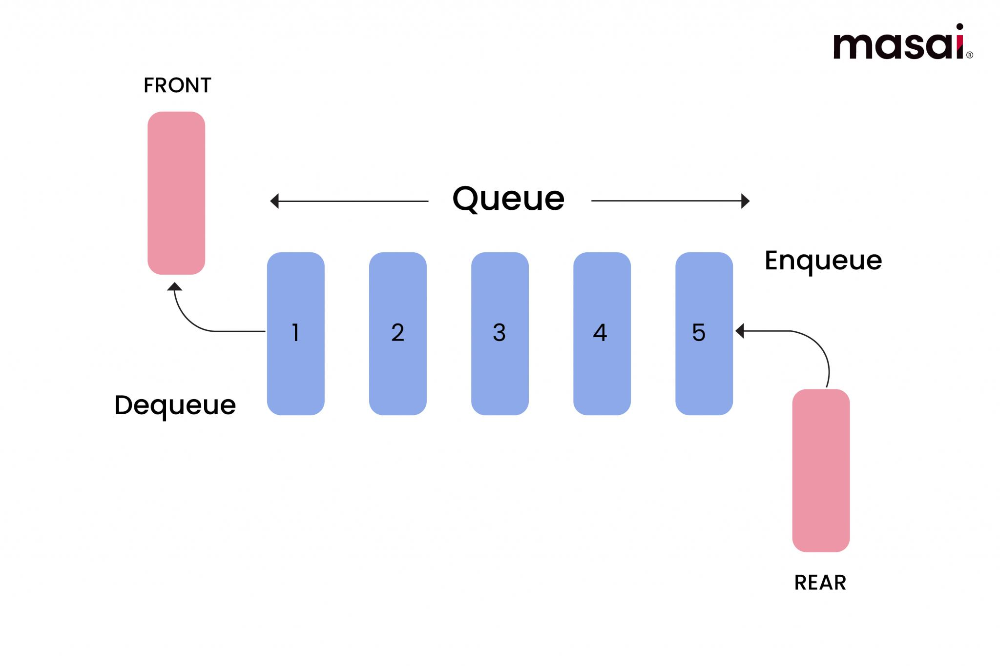

# Queue Data Structure

## What is a Queue?

A **Queue** is a linear data structure that follows the **FIFO (First In, First Out)** principle.

### FIFO Rule

**First In, First Out**

The element that is inserted first is the element that gets removed first.

---


## Real-Life Examples

### 1. Ticket Counter Queue

The first person to join the line is served first.

    Front                         Rear
      ↓                             ↓
    [P1] [P2] [P3] [P4]

P1 entered first, so P1 is served first.

---

### 2. Printer Queue

The first document sent to the printer is printed first.

    Doc1 → Doc2 → Doc3

Doc1 was submitted first, so it is printed first.

---

### 3. Customer Support Requests

Requests are handled in the order they arrive.

    Request1 → Request2 → Request3

Request1 gets processed before Request2 and Request3.

---
## Mental model
```
Queue = waiting line. New arrivals join at the back, service happens at the front, and nobody can skip ahead in a basic queue.
```
## Important distinction
```
A naive array queue that shifts elements after every dequeue is not O(1) dequeue; it becomes O(n). That is exactly why circular queues are taught.
```

## Basic Queue Operations

| Operation | Description |
|------------|-------------|
| Enqueue | Add an element at the rear of the queue |
| Dequeue | Remove an element from the front of the queue |
| Peek / Front | View the front element without removing it |
| isEmpty | Check whether the queue is empty |

---

## Queue Structure

A Queue always has two ends:

### Front

- Elements are removed from here.
- Used during Dequeue operation.

### Rear

- Elements are inserted here.
- Used during Enqueue operation.
```
    Front                     Rear
      ↓                         ↓
    [10] [20] [30] [40] [50]
```
---

## Example of Queue Operations

### Step 1: Enqueue Elements

Insert 10, 20, and 30.
```
    Front          Rear
      ↓              ↓
    [10] [20] [30]
```
---

### Step 2: Dequeue

Remove one element.
```
    Removed: 10

    Front      Rear
      ↓          ↓
    [20] [30]
```
Since 10 was inserted first, it is removed first.

This demonstrates the FIFO principle.

---

## Queue vs Stack

| Feature | Queue | Stack |
|----------|---------|---------|
| Principle | FIFO | LIFO |
| Insertion | Rear | Top |
| Deletion | Front | Top |
| Example | Ticket Line | Stack of Plates |

### Queue
```
    FIFO
    First In → First Out
```
Example:
```
    Insert: 10, 20, 30

    Remove Order:
    10 → 20 → 30
```
---

### Stack
```
    LIFO
    Last In → First Out
```
Example:
```
    Push: 10, 20, 30

    Pop Order:
    30 → 20 → 10
```
---

## Key Points

- Queue follows the FIFO principle.
- Insertion happens at the Rear.
- Deletion happens at the Front.
- A Queue always has two pointers:
  - Front
  - Rear
- Common real-world examples:
  - Ticket counters
  - Printer jobs
  - Customer support requests
  - CPU scheduling

---

## Summary

A Queue is a linear data structure that works on the **First In, First Out (FIFO)** principle.
```
    Enqueue → Rear

    Front ← Dequeue
```
The first element inserted into the Queue is always the first element removed from the Queue.