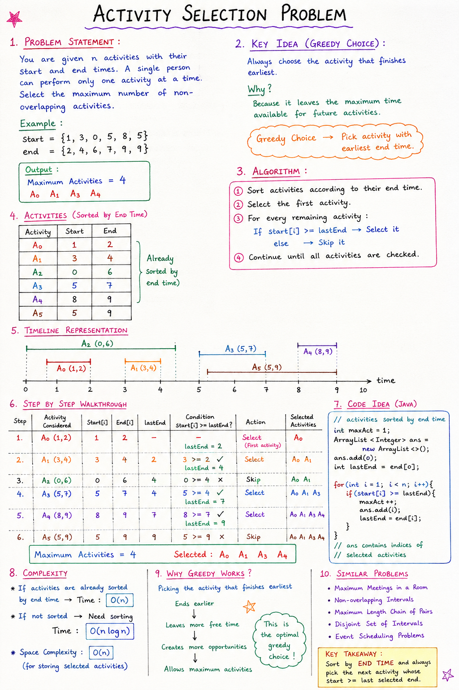

# Activity Selection Problem

## Problem Statement

You are given `n` activities with their start and end times.

A single person can perform only one activity at a time.

The goal is to select the **maximum number of non-overlapping activities**.

# Note:


### Example

```java
start = {1, 3, 0, 5, 8, 5};
end   = {2, 4, 6, 7, 9, 9};
```

Output:

```text
Maximum Activities = 4

A0 A1 A3 A4
```

---

# Observation

Let's represent the activities:

| Activity | Start | End |
|----------|--------|------|
| A0 | 1 | 2 |
| A1 | 3 | 4 |
| A2 | 0 | 6 |
| A3 | 5 | 7 |
| A4 | 8 | 9 |
| A5 | 5 | 9 |

Notice that some activities overlap.

Since only one activity can be performed at a time, we need to choose activities carefully.

---

# Greedy Idea

### Which activity should we choose first?

The activity that **finishes earliest**.

Why?

Because it leaves the maximum amount of time available for future activities.

### Greedy Choice

```text
Always select the activity with the earliest finishing time.
```

This is the key idea behind the Activity Selection Problem.

---

# Why Sort by End Time?

Suppose two activities are available:

```text
Activity A → Ends at 2
Activity B → Ends at 6
```

Choosing Activity A is better because:

```text
Ends Earlier
↓
Leaves More Free Time
↓
Allows More Activities Later
```

Therefore, we sort activities according to their ending times.

---

# Algorithm

### Step 1

Sort activities according to end time.

### Step 2

Select the first activity.

### Step 3

For every remaining activity:

```text
If start time >= last selected activity's end time
    Select it
Else
    Skip it
```

### Step 4

Continue until all activities are checked.

---

# Dry Run

Given:

```java
start = {1, 3, 0, 5, 8, 5};
end   = {2, 4, 6, 7, 9, 9};
```

Activities are already sorted by end time.

---

## Select First Activity

```text
A0 (1,2)
```

Selected Activities:

```text
A0
```

Current End Time:

```text
lastEnd = 2
```

Count:

```text
1
```

---

## Check A1

```text
start = 3
lastEnd = 2

3 >= 2 ✓
```

Select A1

Selected:

```text
A0 A1
```

Update:

```text
lastEnd = 4
```

Count:

```text
2
```

---

## Check A2

```text
start = 0
lastEnd = 4

0 >= 4 ✗
```

Reject

---

## Check A3

```text
start = 5
lastEnd = 4

5 >= 4 ✓
```

Select A3

Selected:

```text
A0 A1 A3
```

Update:

```text
lastEnd = 7
```

Count:

```text
3
```

---

## Check A4

```text
start = 8
lastEnd = 7

8 >= 7 ✓
```

Select A4

Selected:

```text
A0 A1 A3 A4
```

Update:

```text
lastEnd = 9
```

Count:

```text
4
```

---

## Check A5

```text
start = 5
lastEnd = 9

5 >= 9 ✗
```

Reject

---

# Final Answer

Selected Activities:

```text
A0 A1 A3 A4
```

Maximum Activities:

```text
4
```

---

# Code Explanation

### Select First Activity

```java
maxAct = 1;
ans.add(0);
int lastEnd = end[0];
```

Since activities are sorted by end time, the first activity is always selected.

---

### Traverse Remaining Activities

```java
for(int i=1; i<end.length; i++)
```

Check every activity one by one.

---

### Selection Condition

```java
if(start[i] >= lastEnd)
```

Meaning:

```text
Current activity starts after
(or exactly when)
the previous activity ends.
```

Therefore, no overlap occurs.

---

### Select Activity

```java
maxAct++;
ans.add(i);
lastEnd = end[i];
```

- Increase activity count
- Store selected activity
- Update ending time

---

# Time Complexity

### Case 1: Activities Already Sorted

```text
Time Complexity = O(n)
```

Because we traverse the array only once.

---

### Case 2: Activities Not Sorted

Need sorting first.

```text
Sorting = O(n log n)
Traversal = O(n)

Total = O(n log n)
```

---

# Space Complexity

```text
O(n)
```

For storing selected activities in the ArrayList.

---

# Why Does the Greedy Approach Work?

The activity that finishes earliest:

```text
Ends Earlier
↓
Leaves More Free Time
↓
Creates More Opportunities
↓
Allows Maximum Activities
```

Therefore, selecting the earliest finishing activity is always the optimal greedy choice.

---

# Interview Tip

Whenever you hear:

```text
Maximum non-overlapping intervals
Maximum meetings
Maximum events attended
Disjoint intervals
```

Think:

```text
Sort by Ending Time
+
Activity Selection Greedy Approach
```

---

# Similar Interview Problems

1. Activity Selection
2. Maximum Meetings in One Room
3. Non-Overlapping Intervals
4. Maximum Length Chain of Pairs
5. Disjoint Set of Intervals
6. Event Scheduling Problems

---

# Key Takeaways

- Activity Selection is a classic Greedy Algorithm problem.
- Always choose the activity that finishes earliest.
- After selecting an activity, choose the next activity whose:

```text
startTime >= previousEndTime
```

- If activities are already sorted by end time:

```text
Time Complexity = O(n)
```

- If activities are not sorted:

```text
Time Complexity = O(n log n)
```

---

# One-Line Definition

> Activity Selection is a Greedy Algorithm problem in which we select the maximum number of non-overlapping activities by always choosing the activity that finishes earliest.