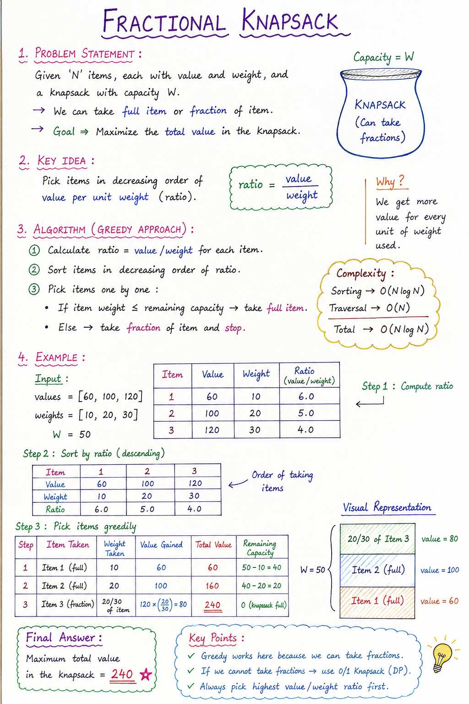

# Fractional Knapsack (Greedy Algorithm)

## 📌 Problem Statement

Given:
- `N` items, each with:
  - value `val[i]`
  - weight `wt[i]`
- A knapsack with capacity `W`

You can take:
- Full item OR
- Fraction of an item

# Note:

### 🎯 Goal:
Maximize the total value that can be put into the knapsack.

---

## 🧠 Key Idea

We use a **Greedy Strategy** based on value per unit weight:

\[
ratio = value / weight
\]

👉 Always pick the item with the highest ratio first.

Why?
Because we want maximum profit per unit weight.

---

## ⚙️ Algorithm

### Step 1: Compute ratio
For each item:
- ratio = value / weight

---

### Step 2: Sort items
Sort items in **descending order of ratio**

---

### Step 3: Fill knapsack

Initialize:
- capacity = W
- finalValue = 0

Then iterate:

#### If item fits completely:
- take full item
- reduce capacity

#### If item does NOT fit:
- take fraction:
  finalValue += ratio * capacity
- stop

---

## 🧮 Example

### Input:
values = [60, 100, 120]  
weights = [10, 20, 30]  
W = 50  

---

### Step 1: Ratios
60/10 = 6  
100/20 = 5  
120/30 = 4  

---

### Step 2: Sorted order
(60,10), (100,20), (120,30)

---

### Step 3: Selection

- Take (60,10)
  - remaining = 40
  - value = 60

- Take (100,20)
  - remaining = 20
  - value = 160

- Take 20/30 of (120,30)
  - value = 120 × (20/30) = 80

---

### ✅ Final Answer:
Total Value = 240

---

## ⏱️ Time Complexity

- Sorting: O(N log N)
- Traversal: O(N)

### Final:
O(N log N)

---

## ⚠️ Important Points

- Greedy works ONLY because fractions are allowed
- Not valid for 0/1 Knapsack

---

## 🔥 Difference: Fractional vs 0/1 Knapsack

| Feature | Fractional | 0/1 Knapsack |
|--------|------------|--------------|
| Fraction allowed | Yes | No |
| Approach | Greedy | DP |
| Optimal greedy? | Yes | No |

---

## 🧠 Interview Tip

If asked:
- Can we break items?
  - YES → Fractional Knapsack (Greedy)
  - NO → 0/1 Knapsack (DP)

---

## 🚀 Summary

Fractional Knapsack:
- Sort by value/weight ratio
- Take highest ratio first
- Take fraction only when needed

👉 Works optimally because items are divisible.