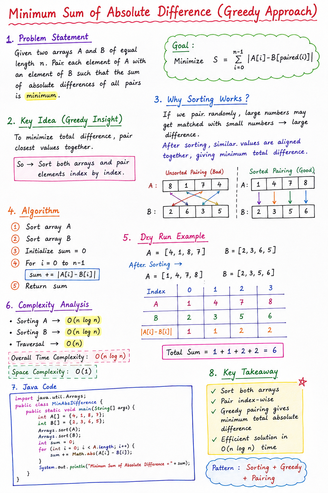

# Minimum Sum of Absolute Difference (Greedy Approach)

## Problem Statement

You are given two arrays A and B of equal length n.

You need to pair each element of A with an element of B such that the **sum of absolute differences is minimized**.

Mathematically:

S = Σ |A[i] - B[paired(i)]|

---

# Note: 


## Idea (Greedy Strategy)

To minimize the total difference:
👉 Pair closest values together.

So the best strategy is:
- Sort both arrays
- Pair elements index by index

---

## Why This Works

If we randomly pair elements:
- Large values may get matched with small values → high cost

After sorting:
- Numbers are arranged in increasing order
- Matching nearest values reduces total mismatch

This gives a globally optimal solution.

---

## Algorithm

1. Sort array A
2. Sort array B
3. Initialize sum = 0
4. For i = 0 to n-1:
   - sum += abs(A[i] - B[i])
5. Return sum

---

## Time Complexity

Sorting dominates:

O(n log n)

---

## Space Complexity

O(1) auxiliary space (excluding sorting internals)

---

## Java Code
```java
import java.util.Arrays;

public class MinAbsDiff {
    public static void main(String[] args) {

        int A[] = {4, 1, 8, 7};
        int B[] = {2, 3, 6, 5};

        Arrays.sort(A);
        Arrays.sort(B);

        int sum = 0;

        for (int i = 0; i < A.length; i++) {
            sum += Math.abs(A[i] - B[i]);
        }

        System.out.println("Minimum Sum of Absolute Difference = " + sum);
    }
}
```
---

## Example Walkthrough

Input:
A = [4, 1, 8, 7]
B = [2, 3, 6, 5]

After Sorting:
A = [1, 4, 7, 8]
B = [2, 3, 5, 6]

Pairing:

1 - 2 = 1  
4 - 3 = 1  
7 - 5 = 2  
8 - 6 = 2  

Total = 6

---

## Key Takeaway

Sorting both arrays before pairing ensures:
✔ Minimum total absolute difference  
✔ Optimal greedy matching  
✔ Efficient O(n log n) solution