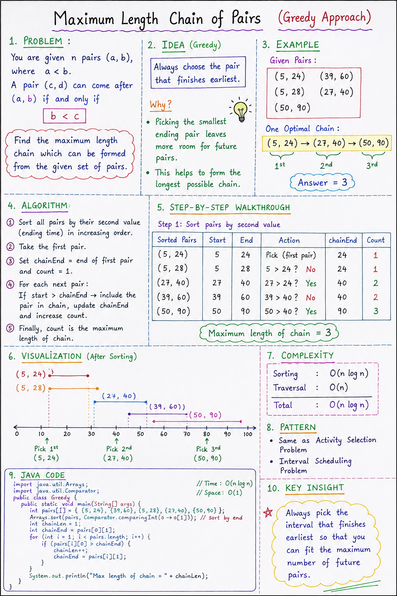

# Maximum Length Chain of Pairs (Greedy Approach)

## Problem Statement

You are given n pairs (a, b), where a < b.

A pair (c, d) can follow (a, b) if:

b < c

Find the maximum length chain.

# Note: 


## Example

Pairs:
(5, 24)
(39, 60)
(5, 28)
(27, 40)
(50, 90)

One valid chain:
(5, 24) → (27, 40) → (50, 90)

Answer: 3

---

## Key Idea (Greedy)

Always pick the pair that finishes earliest.

Why?
Because it leaves maximum room for future pairs.

---

## Algorithm

1. Sort pairs by ending value
2. Take first pair
3. Set chainEnd = first pair end
4. For each next pair:
   - If start > chainEnd:
     - include it
     - update chainEnd
     - increase count

---

## Java Code

(Keep this in a separate code block file if your editor breaks preview)
```java
import java.util.Arrays;
import java.util.Comparator;

public class Greedy {
    public static void main(String[] args) {

        int pairs[][] = {
            {5, 24},
            {39, 60},
            {5, 28},
            {27, 40},
            {50, 90}
        };

        Arrays.sort(pairs, Comparator.comparingInt(o -> o[1]));

        int chainLen = 1;
        int chainEnd = pairs[0][1];

        for (int i = 1; i < pairs.length; i++) {
            if (pairs[i][0] > chainEnd) {
                chainLen++;
                chainEnd = pairs[i][1];
            }
        }

        System.out.println(chainLen);
    }
}
```
---

## Complexity

Time: O(n log n)  
Space: O(1)

---

## Pattern

- Activity Selection Problem
- Interval Scheduling Problem

---

## Final Insight

Pick intervals that finish earliest → maximize chain length