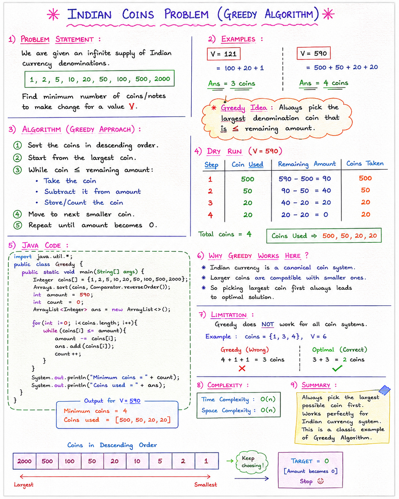

# Indian Coins Problem (Greedy Algorithm)

## Problem
Given unlimited supply of Indian coins:
[1, 2, 5, 10, 20, 50, 100, 500, 2000]

Find minimum number of coins needed to make value V.

---

## Idea (Greedy Strategy)
Always pick the largest coin possible that is <= remaining amount.

Repeat until amount becomes 0.

# Note: 


## Examples

V = 121  
= 100 + 20 + 1  
Answer = 3 coins

V = 590  
= 500 + 50 + 20 + 20  
Answer = 4 coins

---

## Algorithm
1. Sort coins in descending order
2. For each coin:
   - take it while coin <= amount
   - subtract from amount
   - store coin
3. Stop when amount becomes 0

---

## Java Code
```java
import java.util.*;

public class Greedy {
    public static void main(String[] args) {

        Integer coins[] = {1,2,5,10,20,50,100,500,2000};

        Arrays.sort(coins, Comparator.reverseOrder());

        int amount = 590;
        int count = 0;

        ArrayList<Integer> ans = new ArrayList<>();

        for(int i=0;i<coins.length;i++){
            while(coins[i] <= amount){
                amount -= coins[i];
                ans.add(coins[i]);
                count++;
            }
        }

        System.out.println("Coins used = " + count);
        System.out.println(ans);
    }
}
```
---

## Output
Coins used = 4  
[500, 50, 20, 20]

---

## Dry Run

590 → 500 → 90  
90 → 50 → 40  
40 → 20 → 20  
20 → 20 → 0  

---

## Why Greedy Works
Indian currency is a canonical coin system:
- Larger coins are structured well
- Greedy always gives optimal answer

---

## Limitation
Greedy does NOT work for all coin systems.

Example:
coins = [1,3,4], V = 6

Greedy = 4+1+1 = 3 ❌  
Optimal = 3+3 = 2 ✔

---

## Complexity
Time: O(n)  
Space: O(n)

---

## Summary
Greedy works because we always pick the largest possible coin first, which leads to optimal solution in Indian currency system.