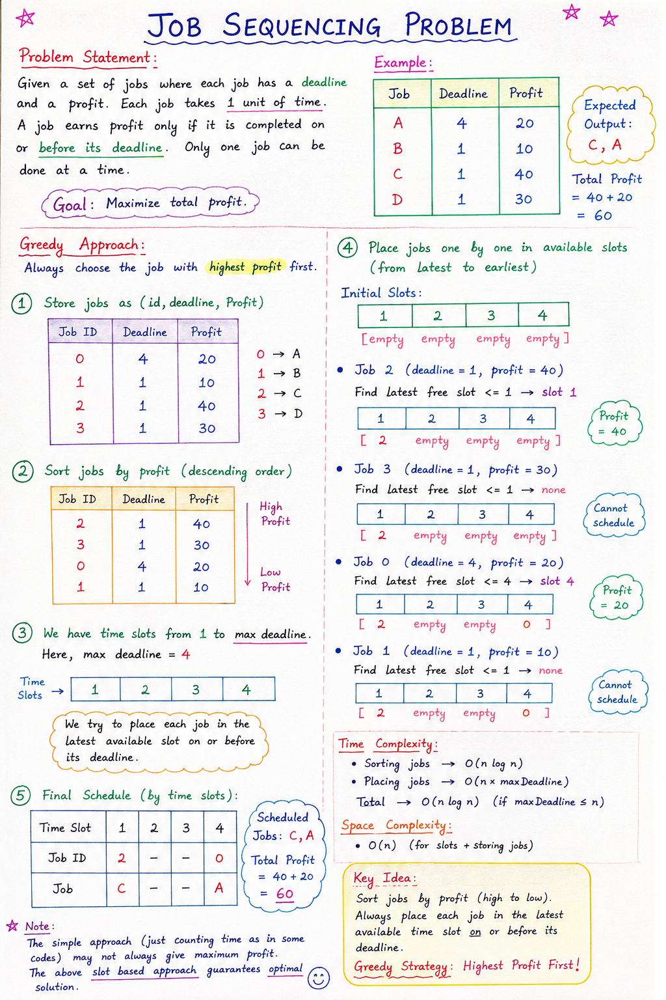

# Job Sequencing Problem (Greedy Algorithm)

## Problem Statement

Given a set of jobs where:

- Each job has a **deadline** and a **profit**.
- Every job takes **1 unit of time** to complete.
- A job earns profit only if it is completed **on or before its deadline**.
- Only **one job can be performed at a time**.

Our goal is to **maximize the total profit**.

# Note: 


## Example

| Job | Deadline | Profit |
|------|----------|---------|
| A | 4 | 20 |
| B | 1 | 10 |
| C | 1 | 40 |
| D | 1 | 30 |

### Expected Output

```text
C, A
```

Total Profit:

```text
40 + 20 = 60
```

---

# Greedy Approach

## Greedy Choice

Always select the job with the **highest profit first**.

Why?

Because choosing a more profitable job earlier increases the chance of maximizing total profit.

---

## Step 1: Store Jobs

Jobs are stored as:

```java
Job(id, deadline, profit)
```

For the example:

```text
Job 0 → (4, 20)
Job 1 → (1, 10)
Job 2 → (1, 40)
Job 3 → (1, 30)
```

---

## Step 2: Sort Jobs by Profit

Sort jobs in descending order of profit.

```java
Collections.sort(jobs,
    (obj1, obj2) -> obj2.profit - obj1.profit);
```

After sorting:

| Job ID | Deadline | Profit |
|---------|----------|---------|
| 2 | 1 | 40 |
| 3 | 1 | 30 |
| 0 | 4 | 20 |
| 1 | 1 | 10 |

---

## Step 3: Select Jobs

Initialize:

```java
time = 0
```

### Iteration 1

Current Job:

```text
Job 2
Deadline = 1
Profit = 40
```

Check:

```java
1 > 0
```

True ✅

Select Job 2.

```text
Sequence = [2]
time = 1
```

---

### Iteration 2

Current Job:

```text
Job 3
Deadline = 1
Profit = 30
```

Check:

```java
1 > 1
```

False ❌

Cannot schedule.

---

### Iteration 3

Current Job:

```text
Job 0
Deadline = 4
Profit = 20
```

Check:

```java
4 > 1
```

True ✅

Select Job 0.

```text
Sequence = [2, 0]
time = 2
```

---

### Iteration 4

Current Job:

```text
Job 1
Deadline = 1
Profit = 10
```

Check:

```java
1 > 2
```

False ❌

Cannot schedule.

---

## Final Sequence

```text
[2, 0]
```

Meaning:

```text
Job C
Job A
```

Total Profit:

```text
40 + 20 = 60
```

---

# Dry Run Table

| Job | Deadline | Profit | Condition | Selected? |
|------|----------|---------|------------|------------|
| 2 | 1 | 40 | 1 > 0 | ✅ |
| 3 | 1 | 30 | 1 > 1 | ❌ |
| 0 | 4 | 20 | 4 > 1 | ✅ |
| 1 | 1 | 10 | 1 > 2 | ❌ |

Result:

```text
Jobs Selected = [2, 0]
Profit = 60
```

---

# Time Complexity

### Creating Jobs List

```text
O(n)
```

### Sorting Jobs

```text
O(n log n)
```

### Traversing Jobs

```text
O(n)
```

Total:

```text
O(n log n)
```

---

# Space Complexity

Jobs List:

```text
O(n)
```

Sequence List:

```text
O(n)
```

Total:

```text
O(n)
```

---

# Important Note

The code shown uses a **simplified greedy approach**:

```java
if(curr.deadline > time)
```

This works for many examples and is commonly taught in beginner DSA courses.

However, the **standard Job Sequencing algorithm** uses:

1. Sort jobs by profit.
2. Create time slots.
3. Place each job in the latest available slot before its deadline.

That version guarantees the maximum possible profit for all test cases.

---

# Key Idea to Remember

> Sort jobs by profit in descending order and greedily select the most profitable jobs that can still be completed before their deadlines.

```
Greedy Strategy:
Highest Profit First
```