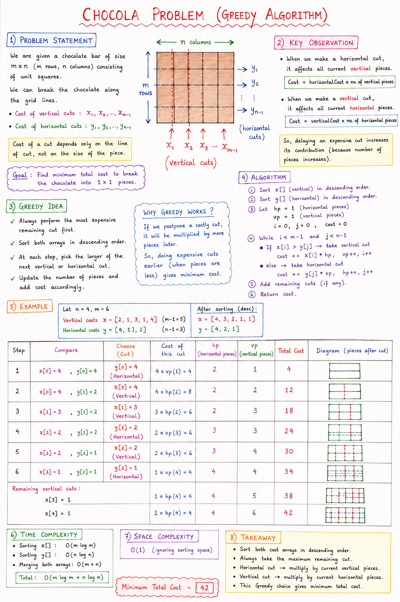

# Chocola Problem

## Problem Statement

We are given a chocolate bar consisting of `m × n` square pieces.

To separate the chocolate into individual squares, we need to make cuts:

- Vertical cuts have costs: `x1, x2, ..., xm-1`
- Horizontal cuts have costs: `y1, y2, ..., yn-1`

The cost of a cut depends only on the cut line and not on the size of the chocolate piece being cut.

**Goal:** Find the minimum total cost required to break the entire chocolate into single squares.

# Note:


## Key Observation

Whenever we make a horizontal cut, it affects all current vertical pieces.

**Cost of Horizontal Cut**

```text
horizontalCost × numberOfVerticalPieces
```

Whenever we make a vertical cut, it affects all current horizontal pieces.

**Cost of Vertical Cut**

```text
verticalCost × numberOfHorizontalPieces
```

Therefore, delaying an expensive cut may increase its total contribution to the final cost.

---

## Greedy Idea

Always perform the most expensive remaining cut first.

### Why?

Expensive cuts should be performed when the number of pieces is as small as possible.

If we delay a costly cut:

```text
costlyCut × largerMultiplier
```

which increases the total cost.

Therefore:

1. Sort vertical costs in descending order.
2. Sort horizontal costs in descending order.
3. Always choose the larger remaining cut.
4. Update the number of pieces after every cut.

---

## Example

### Input

```java
n = 4;
m = 6;

costVer = {2, 1, 3, 1, 4};
costHor = {4, 1, 2};
```

### After Sorting

```java
costVer = {4, 3, 2, 1, 1};
costHor = {4, 2, 1};
```

Initial State:

```text
horizontalPieces = 1
verticalPieces = 1
cost = 0
```

---

## Dry Run

### Step 1

Horizontal Cut = 4

```text
Cost = 4 × 1 = 4
Total = 4
horizontalPieces = 2
```

### Step 2

Vertical Cut = 4

```text
Cost = 4 × 2 = 8
Total = 12
verticalPieces = 2
```

### Step 3

Vertical Cut = 3

```text
Cost = 3 × 2 = 6
Total = 18
verticalPieces = 3
```

### Step 4

Horizontal Cut = 2

```text
Cost = 2 × 3 = 6
Total = 24
horizontalPieces = 3
```

### Step 5

Vertical Cut = 2

```text
Cost = 2 × 3 = 6
Total = 30
verticalPieces = 4
```

### Step 6

Horizontal Cut = 1

```text
Cost = 1 × 4 = 4
Total = 34
horizontalPieces = 4
```

### Remaining Vertical Cuts

```text
1 × 4 = 4
Total = 38
```

```text
1 × 4 = 4
Total = 42
```

---

## Final Answer

```text
Minimum Cost = 42
```

---

## Algorithm

1. Sort horizontal costs in descending order.
2. Sort vertical costs in descending order.
3. Maintain:

```java
hp = 1; // horizontal pieces
vp = 1; // vertical pieces
```

4. Compare the largest remaining horizontal and vertical costs.
5. Choose the larger cost.
6. Update total cost.
7. Increase the corresponding piece count.
8. Continue until all cuts are used.

---

## Why Greedy Works

Suppose an expensive cut has cost `10`.

### Perform Early

```text
10 × 1 = 10
```

### Perform Later

```text
10 × 5 = 50
```

The same cut becomes much more expensive when performed later.

Therefore, we should always perform higher-cost cuts first.

This greedy choice produces the minimum total cost.

---

## Time Complexity

### Sorting

```text
O((m-1) log(m-1))
+
O((n-1) log(n-1))
```

### Traversal

```text
O(m + n)
```

### Overall

```text
O(m log m + n log n)
```

---

## Space Complexity

```text
O(1)
```

(ignoring internal sorting space)

---

## Interview Notes

- Classic Greedy Algorithm problem.
- Sort both cost arrays in descending order.
- Always select the maximum available cut.
- Horizontal cut cost is multiplied by current vertical pieces.
- Vertical cut cost is multiplied by current horizontal pieces.
- Greedy works because expensive cuts should be applied before multipliers become larger.

### Formula

```text
Horizontal Cut Cost = costHor[i] × vp

Vertical Cut Cost = costVer[i] × hp
```

### Complexity

```text
Time  : O(m log m + n log n)
Space : O(1)
```

### Final Output

```text
Minimum Cost = 42
```